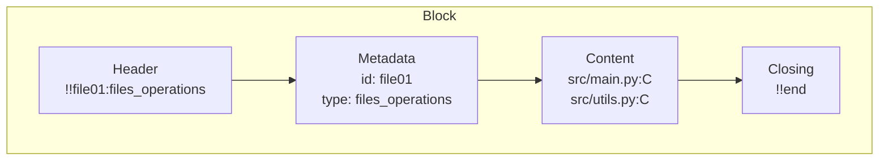
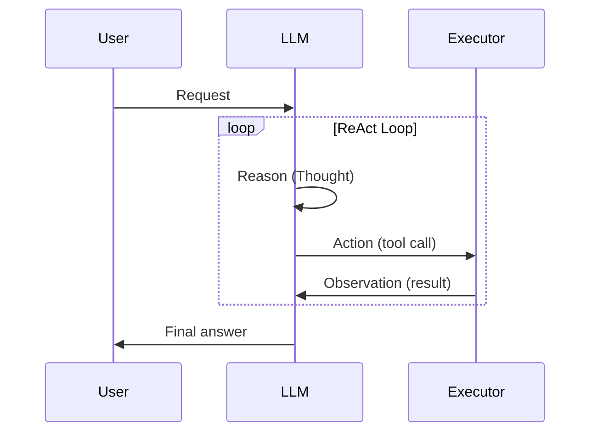
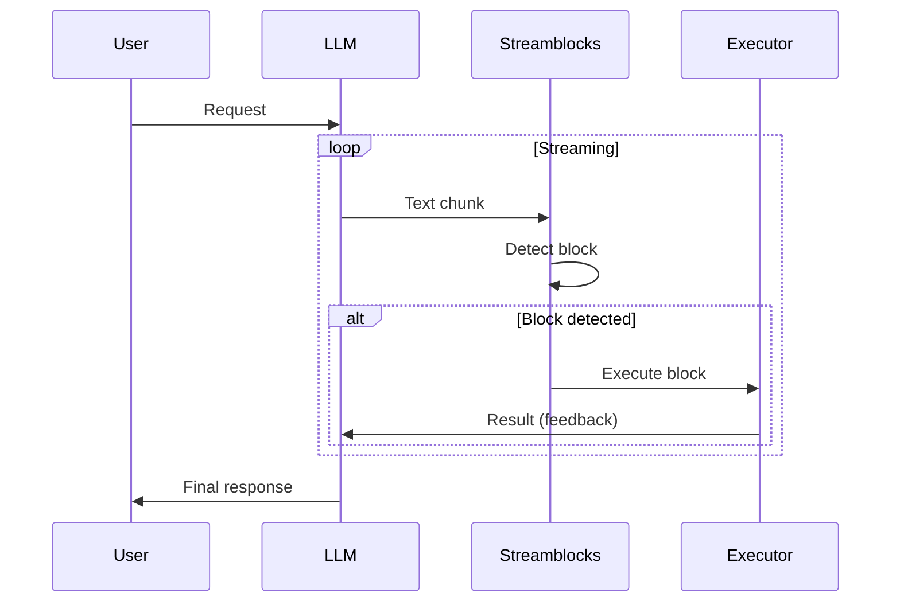
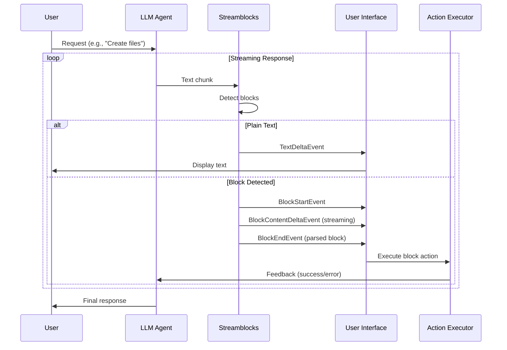
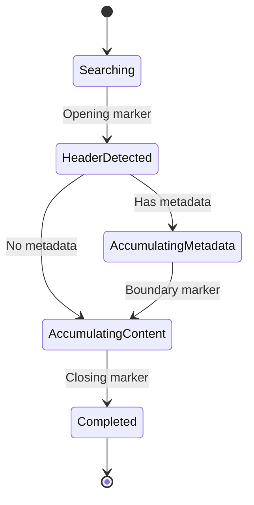
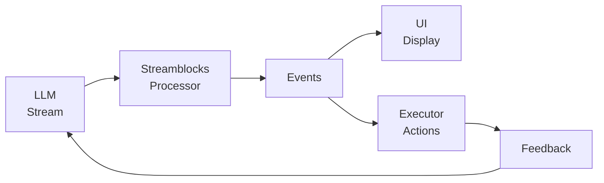

# Streamblocks: Introduction to Blocks and Reactive Agents

Streamblocks is a Python library for real-time extraction of structured blocks from LLM text streams. This document introduces the core concepts and demonstrates how to build reactive agents with feedback loops.

## The Problem

When LLMs generate text, they often include structured actions (create files, run commands, update configs). Traditional approaches wait for the complete response before parsing and executing.

**Streamblocks** detects and extracts structured blocks *while the LLM streams*, enabling immediate execution and real-time feedback to the LLM.

---

## What is a Block?

A **Block** is a structured unit of information extracted from an LLM text stream. Every block has three logical sections:

| Section | Purpose | Example |
|---------|---------|---------|
| **Header** | Opening marker that signals block start | `!!file01:files_operations` |
| **Metadata** | Structured info about the block (id, type) | `id: file01`, `type: files_operations` |
| **Content** | The actionable payload | `src/main.py:C` |

### Block Anatomy



### Example Block

Here's what a block looks like in an LLM response:

```
I'll create the files you need:

!!file01:files_operations
src/main.py:C
src/utils.py:C
tests/test_main.py:C
!!end

The files have been created.
```

- **Header**: `!!file01:files_operations` - identifies the block (id=file01, type=files_operations)
- **Content**: The file operations to perform
- **Closing**: `!!end` - marks the end of the block

---

## The Reactive Agent Pattern

### Standard ReAct Agent Loop

The ReAct (Reasoning + Acting) pattern processes one action at a time in a sequential loop.



### Reactive Streaming Mode

Streamblocks enables multiple actions within a single LLM response, with feedback available during generation.



| Aspect | ReAct | Reactive Streaming |
|--------|-------|-------------------|
| Actions per response | One | Multiple |
| LLM calls per action | One | Shared within stream |
| Feedback timing | After each LLM call | During streaming |

---

## How It Works

### Streaming Flow



### Block Processing States



### Feedback

**Feedback** is the result of executing a block action. This includes:
- Tool execution result (success/error, output data)
- User response to a prompt
- System state change confirmation

The LLM receives this feedback and can use it to inform subsequent responses.

---

## High-Level Architecture



**Components:**
- **LLM Stream**: Text chunks from any LLM provider (Gemini, OpenAI, Anthropic)
- **Streamblocks Processor**: Detects and extracts blocks in real-time
- **Events**: Typed events for text, block lifecycle, and errors
- **UI/Display**: Shows streaming text and block progress
- **Executor**: Runs block actions (file ops, commands, etc.)
- **Feedback**: Execution results sent back to the LLM

---

## Code Examples

### Example 1: Basic Block Detection

```python
from hother.streamblocks import StreamBlockProcessor, Registry
from hother.streamblocks.syntaxes import DelimiterPreambleSyntax

# Setup processor with delimiter syntax
registry = Registry(syntax=DelimiterPreambleSyntax())
processor = StreamBlockProcessor(registry)

# Simulate LLM stream
text = """Here are the files to create:
!!file01:files_operations
src/main.py:C
src/utils.py:C
!!end
Done!"""

# Process character by character (simulating streaming)
for chunk in text:
    for event in processor.process_chunk(chunk):
        if event.type == "BLOCK_END":
            print(f"Block detected: {event.block_type}")
            print(f"Content: {event.content}")

# Don't forget to finalize
for event in processor.finalize():
    print(f"Final event: {event.type}")
```

### Example 2: Reactive Agent with Feedback Loop

```python
async def reactive_agent(user_request: str):
    """
    A reactive agent that executes blocks as they're detected
    and feeds execution results back to the LLM.
    """
    messages = [{"role": "user", "content": user_request}]

    while True:
        # Stream from LLM
        stream = llm.stream(messages)
        processor = StreamBlockProcessor(registry)

        feedback_messages = []

        async for chunk in stream:
            for event in processor.process_chunk(chunk):
                if event.type == "BLOCK_END":
                    # Execute action immediately
                    result = execute_action(event.get_block())

                    if result.success:
                        feedback_messages.append(
                            f"OK {event.block_id}: Success"
                        )
                    else:
                        feedback_messages.append(
                            f"ERROR {event.block_id}: {result.error}"
                        )

        # If all successful, we're done
        if all("OK" in msg for msg in feedback_messages):
            break

        # Feed results back to LLM
        messages.append({
            "role": "assistant",
            "content": processor.get_full_response()
        })
        messages.append({
            "role": "user",
            "content": (
                f"Results:\n" +
                "\n".join(feedback_messages) +
                "\nPlease fix the errors."
            )
        })
```

### Example 3: Streaming UI with Real-time Block Display

```python
async def streaming_ui(llm_stream):
    """
    Display streaming text and blocks in real-time.
    """
    processor = StreamBlockProcessor(registry)

    async for event in processor.process_stream(llm_stream):
        match event.type:
            case "TEXT_DELTA":
                # Show text as it arrives
                print(event.delta, end="", flush=True)

            case "BLOCK_START":
                # Visual indicator that a block is being parsed
                print(f"\n[Block started: {event.syntax}]")

            case "BLOCK_CONTENT_DELTA":
                # Show block content streaming
                print(f"  {event.delta}")

            case "BLOCK_END":
                # Block complete - execute action
                block = event.get_block()
                result = await execute(block)
                print(f"[Block complete: {result}]")

            case "BLOCK_ERROR":
                # Handle block errors
                print(f"[Block error: {event.reason}]")
```

---

## Summary

Streamblocks enables **reactive agents** by:

1. **Real-time detection**: Blocks are detected during streaming
2. **Immediate execution**: Actions run as soon as blocks complete
3. **Feedback**: Execution results are sent back to the LLM
4. **Provider agnostic**: Works with Gemini, OpenAI, Anthropic, and more
