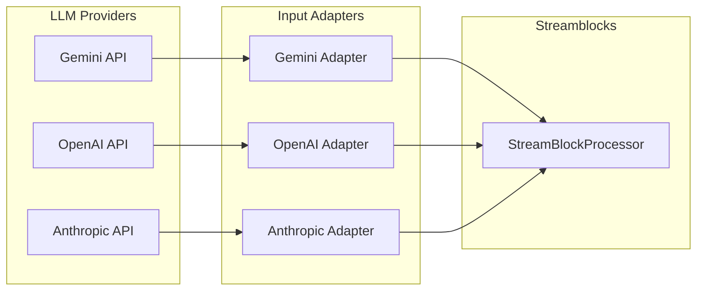

# Adapters

Adapters normalize provider-specific streams into text chunks that Streamblocks can process. This guide covers the built-in adapters and how to work with different LLM providers.

## Overview



## Installation

Install provider-specific extras:

```bash
pip install streamblocks[gemini]      # Google Gemini
pip install streamblocks[openai]      # OpenAI
pip install streamblocks[anthropic]   # Anthropic
pip install streamblocks[all]         # All providers
```

## Auto-Detection

The simplest approach is auto-detection:

```python
processor = StreamBlockProcessor(
    registry=registry,
    syntax=syntax,
    input_adapter="auto",  # Detect from first event
)

async for event in processor.process_stream(any_provider_stream):
    handle_event(event)
```

Auto-detection tries adapters in order until one matches:

1. Gemini adapter (if installed)
2. OpenAI adapter (if installed)
3. Anthropic adapter (if installed)
4. Identity adapter (plain text fallback)

## Google Gemini

### Setup

```python
import google.generativeai as genai

genai.configure(api_key="your-api-key")  # pragma: allowlist secret  # pragma: allowlist secret
model = genai.GenerativeModel("gemini-pro")
```

### With Auto-Detection

```python
response = model.generate_content(prompt, stream=True)

processor = StreamBlockProcessor(
    registry=registry,
    syntax=syntax,
    input_adapter="auto",
)

async for event in processor.process_stream(response):
    handle_event(event)
```

### With Explicit Adapter

```python
from streamblocks.ext.gemini import GeminiInputAdapter

adapter = GeminiInputAdapter()
processor = StreamBlockProcessor(
    registry=registry,
    syntax=syntax,
    input_adapter=adapter,
)
```

### Full Example

```python
import asyncio
import google.generativeai as genai
from streamblocks import StreamBlockProcessor, BlockRegistry, Syntax, EventType

async def main():
    genai.configure(api_key="your-api-key")  # pragma: allowlist secret  # pragma: allowlist secret
    model = genai.GenerativeModel("gemini-pro")

    prompt = """
    Create a task list:

    !!task01:task
    Review pull requests
    !!end

    !!task02:task
    Update documentation
    !!end
    """

    response = model.generate_content(prompt, stream=True)

    registry = BlockRegistry()
    processor = StreamBlockProcessor(
        registry=registry,
        syntax=Syntax.DELIMITER_PREAMBLE,
        input_adapter="auto",
    )

    async for event in processor.process_stream(response):
        if event.type == EventType.BLOCK_EXTRACTED:
            print(f"Task: {event.block.content.raw_content}")

asyncio.run(main())
```

## OpenAI

### Setup

```python
from openai import OpenAI

client = OpenAI(api_key="your-api-key")  # pragma: allowlist secret
```

### With Explicit Adapter

```python
from streamblocks.ext.openai import OpenAIInputAdapter

adapter = OpenAIInputAdapter()
processor = StreamBlockProcessor(
    registry=registry,
    syntax=syntax,
    input_adapter=adapter,
)

stream = client.chat.completions.create(
    model="gpt-4",
    messages=[{"role": "user", "content": prompt}],
    stream=True,
)

async for event in processor.process_stream(stream):
    handle_event(event)
```

### Full Example

```python
import asyncio
from openai import OpenAI
from streamblocks import StreamBlockProcessor, BlockRegistry, Syntax, EventType
from streamblocks.ext.openai import OpenAIInputAdapter

async def main():
    client = OpenAI(api_key="your-api-key")  # pragma: allowlist secret

    prompt = """
    Create a task list using this format:
    !!id:task
    content
    !!end
    """

    stream = client.chat.completions.create(
        model="gpt-4",
        messages=[{"role": "user", "content": prompt}],
        stream=True,
    )

    registry = BlockRegistry()
    processor = StreamBlockProcessor(
        registry=registry,
        syntax=Syntax.DELIMITER_PREAMBLE,
        input_adapter=OpenAIInputAdapter(),
    )

    async for event in processor.process_stream(stream):
        if event.type == EventType.BLOCK_EXTRACTED:
            print(f"Extracted: {event.block.metadata.id}")

asyncio.run(main())
```

## Anthropic

### Setup

```python
import anthropic

client = anthropic.Anthropic(api_key="your-api-key")  # pragma: allowlist secret
```

### With Explicit Adapter

```python
from streamblocks.ext.anthropic import AnthropicInputAdapter

adapter = AnthropicInputAdapter()
processor = StreamBlockProcessor(
    registry=registry,
    syntax=syntax,
    input_adapter=adapter,
)

with client.messages.stream(
    model="claude-3-opus",
    max_tokens=1024,
    messages=[{"role": "user", "content": prompt}],
) as stream:
    async for event in processor.process_stream(stream):
        handle_event(event)
```

### Full Example

```python
import asyncio
import anthropic
from streamblocks import StreamBlockProcessor, BlockRegistry, Syntax, EventType
from streamblocks.ext.anthropic import AnthropicInputAdapter

async def main():
    client = anthropic.Anthropic(api_key="your-api-key")  # pragma: allowlist secret

    prompt = """
    Create tasks in this format:
    !!id:task
    content
    !!end
    """

    registry = BlockRegistry()
    processor = StreamBlockProcessor(
        registry=registry,
        syntax=Syntax.DELIMITER_PREAMBLE,
        input_adapter=AnthropicInputAdapter(),
    )

    with client.messages.stream(
        model="claude-3-opus",
        max_tokens=1024,
        messages=[{"role": "user", "content": prompt}],
    ) as stream:
        async for event in processor.process_stream(stream):
            if event.type == EventType.BLOCK_EXTRACTED:
                print(f"Extracted: {event.block.metadata.id}")

asyncio.run(main())
```

## Identity Adapter

For plain text streams (no LLM provider):

```python
from streamblocks.adapters import IdentityAdapter

# Explicit
processor = StreamBlockProcessor(
    registry=registry,
    syntax=syntax,
    input_adapter=IdentityAdapter(),
)

# Or just use a string stream
async def string_stream():
    yield "!!task01:task\n"
    yield "Do something\n"
    yield "!!end\n"

async for event in processor.process_stream(string_stream()):
    handle_event(event)
```

## Callable Adapters

Use a simple function as an adapter:

```python
def my_adapter(event):
    """Extract text from custom events."""
    if hasattr(event, "text"):
        return event.text
    if hasattr(event, "content"):
        return event.content
    return str(event)

processor = StreamBlockProcessor(
    registry=registry,
    syntax=syntax,
    input_adapter=my_adapter,
)
```

## Custom Adapters

Create adapters for custom providers:

```python
from streamblocks.adapters import EventCategory

class MyProviderAdapter:
    """Adapter for MyProvider API."""

    def categorize(self, event) -> EventCategory:
        """Categorize incoming events."""
        if hasattr(event, "type"):
            match event.type:
                case "content":
                    return EventCategory.TEXT_CONTENT
                case "start":
                    return EventCategory.STREAM_START
                case "end":
                    return EventCategory.STREAM_END
                case "metadata":
                    return EventCategory.PASSTHROUGH
        return EventCategory.SKIP

    def extract_text(self, event) -> str:
        """Extract text from TEXT_CONTENT events."""
        return event.content if hasattr(event, "content") else ""
```

### Event Categories

| Category | Description |
|----------|-------------|
| `TEXT_CONTENT` | Contains text to process |
| `STREAM_START` | Stream is starting |
| `STREAM_END` | Stream is ending |
| `PASSTHROUGH` | Pass through unchanged |
| `SKIP` | Ignore this event |

## Output Adapters

Transform Streamblocks events to other formats:

```python
from streamblocks.ext.agui import AGUIOutputAdapter

processor = StreamBlockProcessor(
    registry=registry,
    syntax=syntax,
    output_adapter=AGUIOutputAdapter(),
)
```

### Custom Output Adapter

```python
class JSONOutputAdapter:
    """Convert events to JSON."""

    def to_protocol_event(self, event):
        return {
            "type": event.type.name,
            "timestamp": event.timestamp.isoformat(),
            "data": self._serialize(event),
        }

    def _serialize(self, event):
        if event.type == EventType.BLOCK_EXTRACTED:
            return {
                "id": event.block.metadata.id,
                "type": event.block.metadata.block_type,
                "content": event.block.content.raw_content,
            }
        return {}

    def passthrough(self, event):
        return {"type": "passthrough", "data": str(event)}
```

## Comparison

| Feature | Gemini | OpenAI | Anthropic | Identity |
|---------|--------|--------|-----------|----------|
| Auto-detect | Yes | Yes | Yes | Yes |
| Streaming | Yes | Yes | Yes | Yes |
| Event types | Multiple | Chunk | Multiple | String |
| Extra needed | gemini | openai | anthropic | None |

## Best Practices

!!! tip "Use Auto-Detection for Flexibility"
    Auto-detection makes your code work with any supported provider.

!!! tip "Explicit Adapters for Control"
    Use explicit adapters when you need specific behavior or optimization.

!!! tip "Handle Provider Errors"
    Wrap provider calls in try-except to handle API errors gracefully.

!!! tip "Test with Mock Streams"
    Use identity adapter with string streams for testing without API calls.

## Next Steps

- [Architecture: Adapters](architecture/adapters.md) - Adapter internals
- [Events](events.md) - Event system details
- [Examples: Adapters](examples/adapters.md) - More examples
