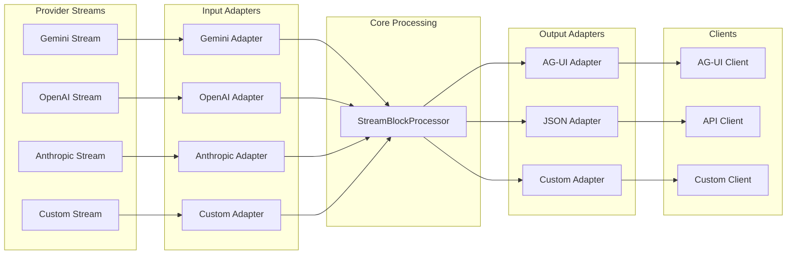
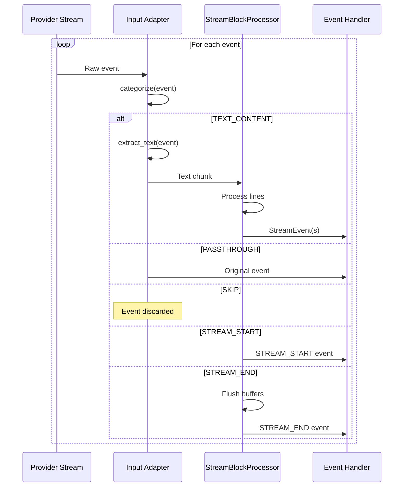
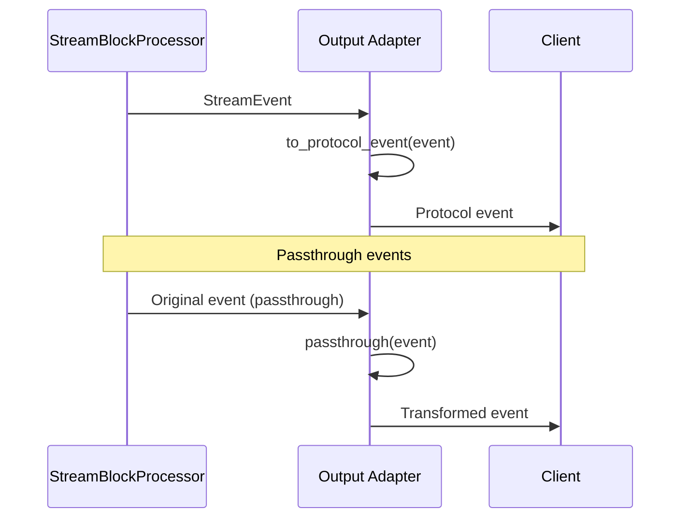
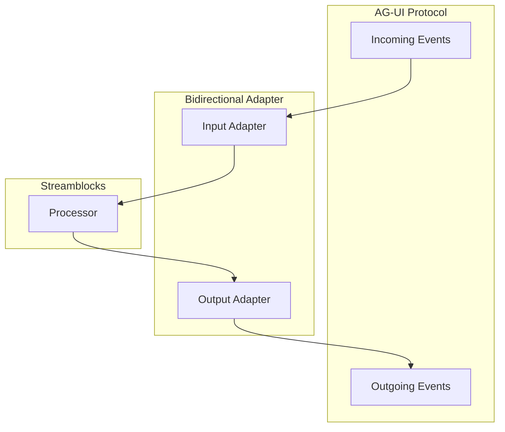

# Adapter Protocol

Streamblocks uses adapters to normalize diverse input streams and transform output events. This document details the adapter protocols and how to implement custom adapters.

## Overview



## Input Adapter Protocol

Input adapters normalize provider-specific events to text chunks:

```python
from typing import Any, Protocol
from streamblocks.adapters import EventCategory

class InputAdapter(Protocol):
    """Protocol for input stream adapters."""

    def categorize(self, event: Any) -> EventCategory:
        """Categorize an incoming event.

        Args:
            event: Raw event from the provider stream

        Returns:
            EventCategory indicating how to handle the event
        """
        ...

    def extract_text(self, event: Any) -> str:
        """Extract text content from a TEXT_CONTENT event.

        Args:
            event: Raw event that was categorized as TEXT_CONTENT

        Returns:
            The text content from the event
        """
        ...
```

### Event Categories

```python
class EventCategory(Enum):
    """Categories for incoming events."""

    TEXT_CONTENT = "text_content"
    """Event contains text to process."""

    PASSTHROUGH = "passthrough"
    """Pass event through unchanged to output."""

    SKIP = "skip"
    """Ignore this event entirely."""

    STREAM_START = "stream_start"
    """Stream is starting."""

    STREAM_END = "stream_end"
    """Stream is ending."""
```

### Processing Flow



## Output Adapter Protocol

Output adapters transform Streamblocks events to protocol-specific formats:

```python
from typing import Any, Protocol
from streamblocks import StreamEvent

class OutputAdapter(Protocol):
    """Protocol for output stream adapters."""

    def to_protocol_event(self, event: StreamEvent) -> Any:
        """Convert a Streamblocks event to protocol format.

        Args:
            event: Streamblocks event to convert

        Returns:
            Protocol-specific event representation
        """
        ...

    def passthrough(self, event: Any) -> Any:
        """Handle a passthrough event.

        Args:
            event: Original event from input

        Returns:
            Event to emit (may be transformed or unchanged)
        """
        ...
```

### Output Flow



## Built-in Adapters

### Identity Adapter

The default adapter for plain text streams:

```python
class IdentityInputAdapter:
    """Adapter for plain text streams."""

    def categorize(self, event: Any) -> EventCategory:
        if isinstance(event, str):
            return EventCategory.TEXT_CONTENT
        return EventCategory.SKIP

    def extract_text(self, event: Any) -> str:
        return str(event)
```

### Callable Adapter

Use a simple function as an adapter:

```python
def my_adapter(event):
    """Extract text from custom events."""
    if hasattr(event, "text"):
        return event.text
    return ""

processor = StreamBlockProcessor(
    registry=registry,
    syntax=syntax,
    input_adapter=my_adapter,
)
```

### Attribute Adapter

Generic adapter that extracts from an attribute:

```python
from streamblocks.adapters import AttributeAdapter

# Extract from 'content' attribute
adapter = AttributeAdapter(attribute="content")

# Extract from nested attribute
adapter = AttributeAdapter(attribute="data.text")
```

## Custom Input Adapter

### Basic Example

```python
from streamblocks.adapters import EventCategory

class MyProviderAdapter:
    """Adapter for MyProvider streaming API."""

    def categorize(self, event) -> EventCategory:
        # Check event type
        if hasattr(event, "type"):
            if event.type == "content":
                return EventCategory.TEXT_CONTENT
            elif event.type == "start":
                return EventCategory.STREAM_START
            elif event.type == "end":
                return EventCategory.STREAM_END
            elif event.type == "metadata":
                return EventCategory.PASSTHROUGH

        return EventCategory.SKIP

    def extract_text(self, event) -> str:
        # Extract text from content event
        if hasattr(event, "content"):
            return event.content
        return ""
```

### Stateful Adapter

For adapters that need to track state:

```python
class StatefulAdapter:
    """Adapter with internal state tracking."""

    def __init__(self):
        self.chunk_count = 0
        self.total_chars = 0
        self.started = False

    def categorize(self, event) -> EventCategory:
        if event.type == "delta":
            self.chunk_count += 1
            return EventCategory.TEXT_CONTENT
        elif event.type == "done":
            return EventCategory.STREAM_END
        return EventCategory.SKIP

    def extract_text(self, event) -> str:
        text = event.text or ""
        self.total_chars += len(text)
        return text

    def get_stats(self) -> dict:
        return {
            "chunks": self.chunk_count,
            "total_chars": self.total_chars,
        }
```

### Filtering Adapter

Filter events based on criteria:

```python
class FilteringAdapter:
    """Adapter that filters events."""

    def __init__(self, include_types: set[str]):
        self.include_types = include_types

    def categorize(self, event) -> EventCategory:
        if event.type not in self.include_types:
            return EventCategory.SKIP

        if event.type == "text":
            return EventCategory.TEXT_CONTENT

        return EventCategory.PASSTHROUGH

    def extract_text(self, event) -> str:
        return event.content
```

## Custom Output Adapter

### JSON Output

```python
import json
from streamblocks import StreamEvent, EventType

class JSONOutputAdapter:
    """Convert events to JSON format."""

    def to_protocol_event(self, event: StreamEvent) -> dict:
        base = {
            "type": event.type.name,
            "timestamp": event.timestamp.isoformat(),
        }

        if event.type == EventType.BLOCK_EXTRACTED:
            base["block"] = {
                "id": event.block.metadata.id,
                "type": event.block.metadata.block_type,
                "content": event.block.content.raw_content,
            }
        elif event.type == EventType.TEXT_DELTA:
            base["text"] = event.text
        elif event.type == EventType.BLOCK_REJECTED:
            base["rejection"] = {
                "reason": event.rejection.reason.value,
                "message": event.rejection.message,
            }

        return base

    def passthrough(self, event) -> dict:
        # Convert any event to JSON-serializable dict
        return {"type": "passthrough", "data": str(event)}
```

### SSE Output

```python
class SSEOutputAdapter:
    """Convert events to Server-Sent Events format."""

    def to_protocol_event(self, event: StreamEvent) -> str:
        data = json.dumps(self._serialize(event))
        return f"event: {event.type.name}\ndata: {data}\n\n"

    def _serialize(self, event: StreamEvent) -> dict:
        # Convert to JSON-serializable dict
        ...

    def passthrough(self, event) -> str:
        return f"event: passthrough\ndata: {event}\n\n"
```

## Adapter Selection

### Auto-Detection

```python
processor = StreamBlockProcessor(
    registry=registry,
    syntax=syntax,
    input_adapter="auto",  # Detect from first event
)

async for event in processor.process_stream(stream):
    # First event triggers adapter selection
    ...
```

Auto-detection tries adapters in order:

1. Gemini adapter (if installed)
2. OpenAI adapter (if installed)
3. Anthropic adapter (if installed)
4. Identity adapter (fallback)

### Explicit Selection

```python
from streamblocks.ext.gemini import GeminiInputAdapter

adapter = GeminiInputAdapter()
processor = StreamBlockProcessor(
    registry=registry,
    syntax=syntax,
    input_adapter=adapter,
)
```

## Bidirectional Adapters

Some protocols need both input and output adaptation:



```python
class BidirectionalAdapter:
    """Combined input and output adapter."""

    def __init__(self):
        self.input = MyInputAdapter()
        self.output = MyOutputAdapter()

    # Delegate to respective adapters
    def categorize(self, event):
        return self.input.categorize(event)

    def extract_text(self, event):
        return self.input.extract_text(event)

    def to_protocol_event(self, event):
        return self.output.to_protocol_event(event)

    def passthrough(self, event):
        return self.output.passthrough(event)
```

## Best Practices

!!! tip "Handle All Event Types"
    Always return a valid category for any event. Use `SKIP` for unrecognized events.

!!! tip "Preserve Streaming Semantics"
    Don't buffer too much. Return text as soon as it's available.

!!! tip "Be Defensive"
    Check for `None` values and missing attributes. Provider APIs may vary.

!!! tip "Log for Debugging"
    Add logging to help debug adapter issues:

    ```python
    import structlog
    logger = structlog.get_logger()

    def categorize(self, event):
        category = self._determine_category(event)
        logger.debug("adapter.categorize", event_type=type(event), category=category)
        return category
    ```

!!! tip "Test with Real Streams"
    Test adapters with actual provider streams, not just mock data.

## Next Steps

- [Extension System](extensions.md) - Provider extensions
- [State Machine](state-machine.md) - Block processing internals
- [API Reference](../reference/adapters.md) - Adapter API details
