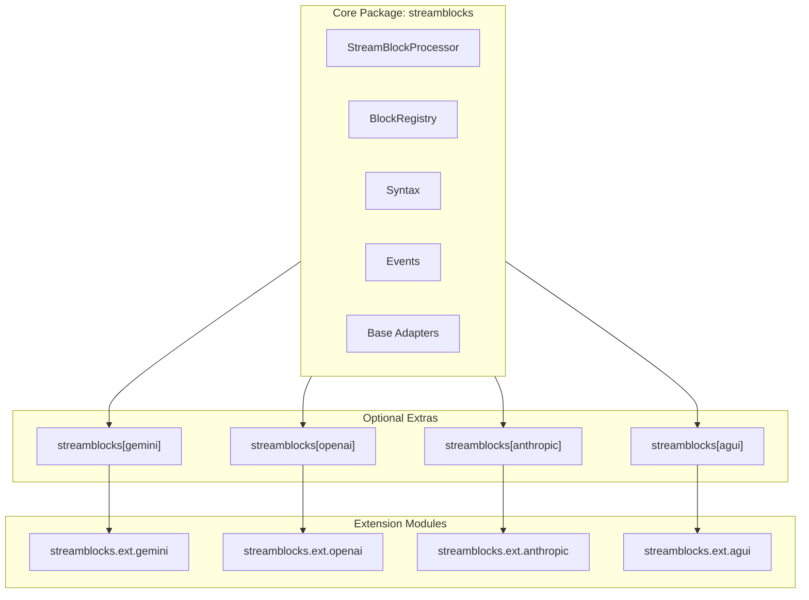
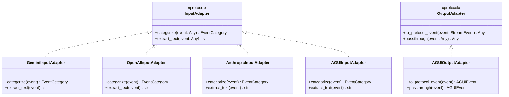
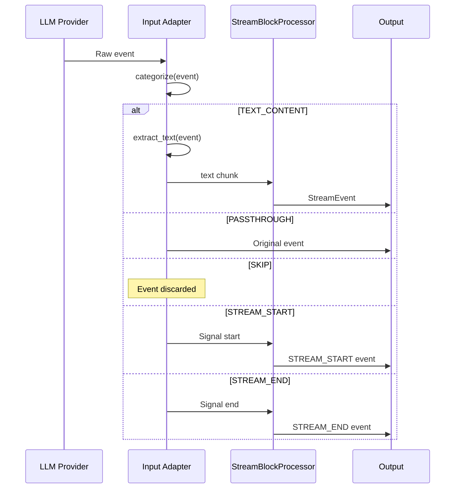
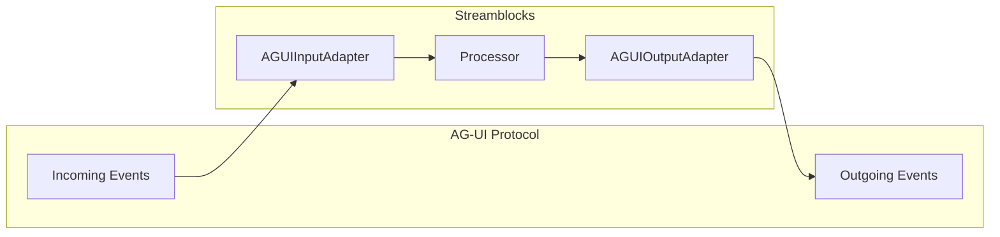
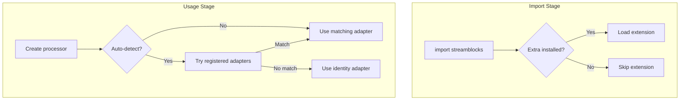

# Extension System

Streamblocks uses a modular extension architecture to support multiple LLM providers and output protocols. This design keeps the core library lightweight while enabling rich integrations.

## Overview



## Extension Structure

Each extension follows a consistent structure:

```
streamblocks/
├── ext/
│   ├── gemini/
│   │   ├── __init__.py      # Public exports
│   │   ├── adapter.py       # Input adapter
│   │   └── types.py         # Provider types
│   ├── openai/
│   │   ├── __init__.py
│   │   ├── adapter.py
│   │   └── types.py
│   ├── anthropic/
│   │   ├── __init__.py
│   │   ├── adapter.py
│   │   └── types.py
│   └── agui/
│       ├── __init__.py
│       ├── input_adapter.py  # Input adapter
│       ├── output_adapter.py # Output adapter
│       └── types.py
```

## Adapter Protocol

Extensions implement the adapter protocol to integrate with the core processor:



### Event Categories

Input adapters categorize incoming events:

```python
class EventCategory(Enum):
    """Categories for incoming events."""

    TEXT_CONTENT = "text_content"      # Contains extractable text
    PASSTHROUGH = "passthrough"        # Pass through unchanged
    SKIP = "skip"                      # Ignore this event
    STREAM_START = "stream_start"      # Stream is starting
    STREAM_END = "stream_end"          # Stream is ending
```

### Categorization Flow



## Provider Extensions

### Gemini Extension

Handles Google Gemini API responses:

```python
from streamblocks.ext.gemini import GeminiInputAdapter

# Automatic adapter selection
processor = StreamBlockProcessor(
    registry=registry,
    syntax=syntax,
    input_adapter="auto",  # Detects Gemini events
)

# Explicit adapter
adapter = GeminiInputAdapter()
processor = StreamBlockProcessor(
    registry=registry,
    syntax=syntax,
    input_adapter=adapter,
)
```

Event handling:

| Gemini Event | Category | Action |
|--------------|----------|--------|
| `GenerateContentResponse` | TEXT_CONTENT | Extract text from candidates |
| Stream start | STREAM_START | Initialize processing |
| Stream end | STREAM_END | Finalize processing |

### OpenAI Extension

Handles OpenAI API streaming responses:

```python
from streamblocks.ext.openai import OpenAIInputAdapter

adapter = OpenAIInputAdapter()
processor = StreamBlockProcessor(
    registry=registry,
    syntax=syntax,
    input_adapter=adapter,
)
```

Event handling:

| OpenAI Event | Category | Action |
|--------------|----------|--------|
| `ChatCompletionChunk` | TEXT_CONTENT | Extract delta content |
| `[DONE]` | STREAM_END | Finalize processing |

### Anthropic Extension

Handles Anthropic Claude streaming events:

```python
from streamblocks.ext.anthropic import AnthropicInputAdapter

adapter = AnthropicInputAdapter()
processor = StreamBlockProcessor(
    registry=registry,
    syntax=syntax,
    input_adapter=adapter,
)
```

Event handling:

| Anthropic Event | Category | Action |
|-----------------|----------|--------|
| `ContentBlockDelta` | TEXT_CONTENT | Extract text delta |
| `MessageStart` | STREAM_START | Initialize |
| `MessageStop` | STREAM_END | Finalize |
| `ContentBlockStart/Stop` | SKIP | Internal events |

### AG-UI Extension

Bidirectional adapter for the AG-UI protocol:

```python
from streamblocks.ext.agui import AGUIInputAdapter, AGUIOutputAdapter

input_adapter = AGUIInputAdapter()
output_adapter = AGUIOutputAdapter()

processor = StreamBlockProcessor(
    registry=registry,
    syntax=syntax,
    input_adapter=input_adapter,
    output_adapter=output_adapter,
)
```



## Creating Custom Extensions

### Step 1: Define Types

```python
# my_extension/types.py
from dataclasses import dataclass
from typing import Any

@dataclass
class MyProviderEvent:
    """Event from my provider."""
    type: str
    content: str | None
    metadata: dict[str, Any]
```

### Step 2: Implement Input Adapter

```python
# my_extension/adapter.py
from streamblocks.adapters import EventCategory

class MyProviderInputAdapter:
    """Input adapter for my provider."""

    def categorize(self, event: Any) -> EventCategory:
        """Categorize an incoming event."""
        if isinstance(event, MyProviderEvent):
            if event.type == "content":
                return EventCategory.TEXT_CONTENT
            elif event.type == "start":
                return EventCategory.STREAM_START
            elif event.type == "end":
                return EventCategory.STREAM_END
        return EventCategory.SKIP

    def extract_text(self, event: Any) -> str:
        """Extract text from a TEXT_CONTENT event."""
        if isinstance(event, MyProviderEvent):
            return event.content or ""
        return ""
```

### Step 3: Register as Extra (Optional)

In `pyproject.toml`:

```toml
[project.optional-dependencies]
my-provider = ["my-provider-sdk>=1.0"]

[project.entry-points."streamblocks.adapters"]
my-provider = "my_extension:MyProviderInputAdapter"
```

## Extension Loading

Extensions are loaded on-demand:



## Best Practices

!!! tip "Keep Extensions Focused"
    Each extension should handle one provider. Don't combine multiple providers in a single extension.

!!! tip "Use Protocol, Not Inheritance"
    Implement the adapter protocol rather than inheriting from base classes. This keeps extensions decoupled.

!!! tip "Handle Unknown Events Gracefully"
    Return `EventCategory.SKIP` for unrecognized events rather than raising errors.

!!! tip "Document Event Mappings"
    Clearly document how provider events map to Streamblocks events.

## Next Steps

- [State Machine](state-machine.md) - Block detection internals
- [Adapter Protocol](adapters.md) - Detailed adapter documentation
- [API Reference](../reference/extensions.md) - Extension API details
