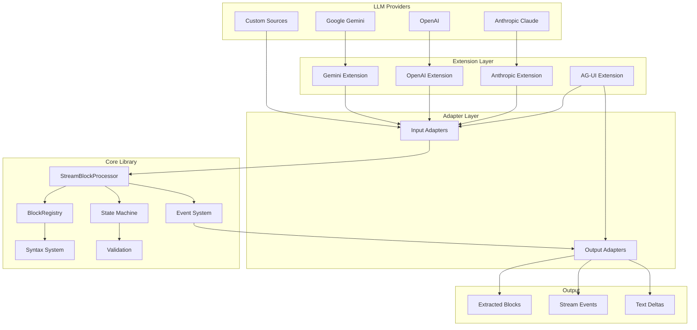
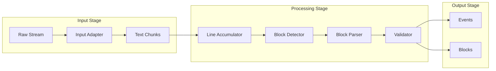
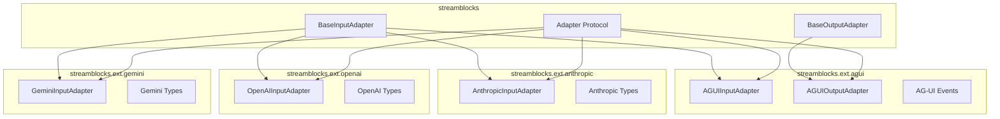
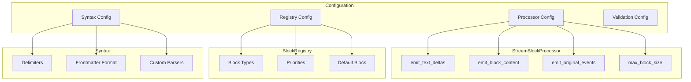

# Architecture Overview

Streamblocks is designed as a modular, extensible system for real-time extraction of structured blocks from text streams. This document provides a high-level overview of the architecture and how the components work together.

## System Overview



## Core Components

### StreamBlockProcessor

The central processing engine that:

- Receives text chunks from adapted streams
- Accumulates lines for block detection
- Manages block state transitions
- Emits events for each processing stage
- Coordinates validation and output

```python
from streamblocks import StreamBlockProcessor, BlockRegistry, Syntax

registry = BlockRegistry()
processor = StreamBlockProcessor(
    registry=registry,
    syntax=Syntax.DELIMITER_PREAMBLE,
    emit_text_deltas=True,
)

async for event in processor.process_stream(stream):
    handle_event(event)
```

### BlockRegistry

Manages registered block types and their handlers:

- Stores metadata and content class mappings
- Provides priority-based type resolution
- Supports custom block type registration
- Handles default block fallback

### Syntax System

Defines how blocks are detected and parsed:

- **DelimiterPreamble**: `!!id:type\ncontent\n!!end`
- **DelimiterFrontmatter**: Delimiters with YAML frontmatter
- **MarkdownFrontmatter**: Code fences with YAML metadata

### Event System

Provides real-time notifications:

| Event Type | Description |
|------------|-------------|
| `STREAM_START` | Stream processing begins |
| `TEXT_DELTA` | Raw text chunk received |
| `BLOCK_OPENED` | Block start detected |
| `BLOCK_CONTENT` | Block content accumulated |
| `BLOCK_EXTRACTED` | Complete block parsed |
| `BLOCK_REJECTED` | Block validation failed |
| `STREAM_END` | Stream processing complete |

## Data Flow



### Processing Pipeline

1. **Adaptation**: Provider-specific streams are normalized to text chunks
2. **Accumulation**: Text is accumulated into complete lines
3. **Detection**: Lines are checked for block markers
4. **Parsing**: Block content is parsed according to syntax
5. **Validation**: Metadata and content are validated
6. **Emission**: Events are emitted for each stage

## Extension Architecture

Streamblocks uses an extension system for provider-specific functionality:



Each extension:

- Implements the adapter protocol
- Handles provider-specific event formats
- Provides type definitions for provider events
- Can be installed independently via extras

## Configuration Layers



## Design Principles

### 1. Streaming-First

Everything is designed for real-time processing:

- Events are emitted as soon as possible
- No buffering of complete responses
- Backpressure-aware async generators

### 2. Protocol-Based Extensibility

Adapters follow protocols, not inheritance:

```python
class InputAdapter(Protocol):
    def categorize(self, event: Any) -> EventCategory: ...
    def extract_text(self, event: Any) -> str: ...
```

### 3. Type Safety

Full type annotations throughout:

- Generic block types
- Protocol-based adapters
- Validated Pydantic models

### 4. Zero Dependencies Core

Core library has minimal dependencies:

- `pydantic` for validation
- Standard library for everything else
- Provider SDKs are optional extras

## Next Steps

- [Extension System](extensions.md) - Deep dive into extensions
- [State Machine](state-machine.md) - Block detection internals
- [Adapter Protocol](adapters.md) - Creating custom adapters
