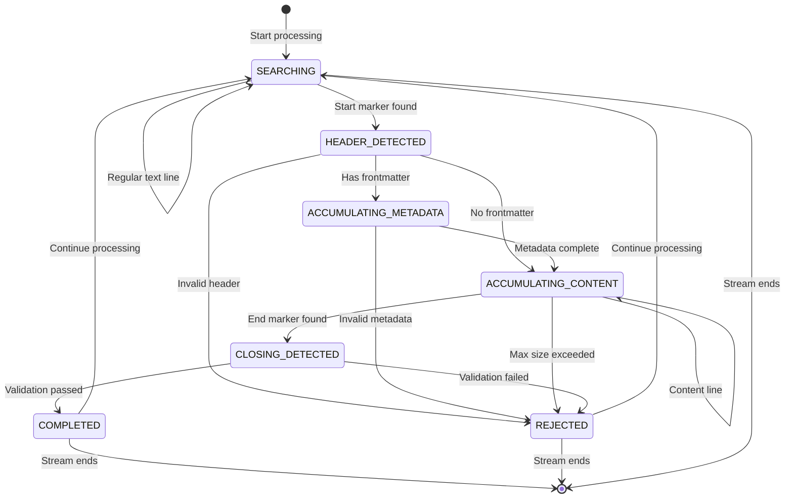
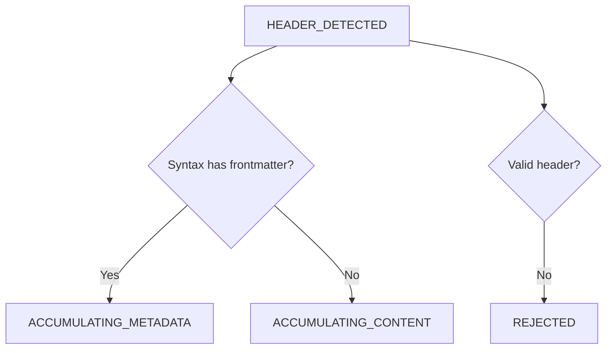
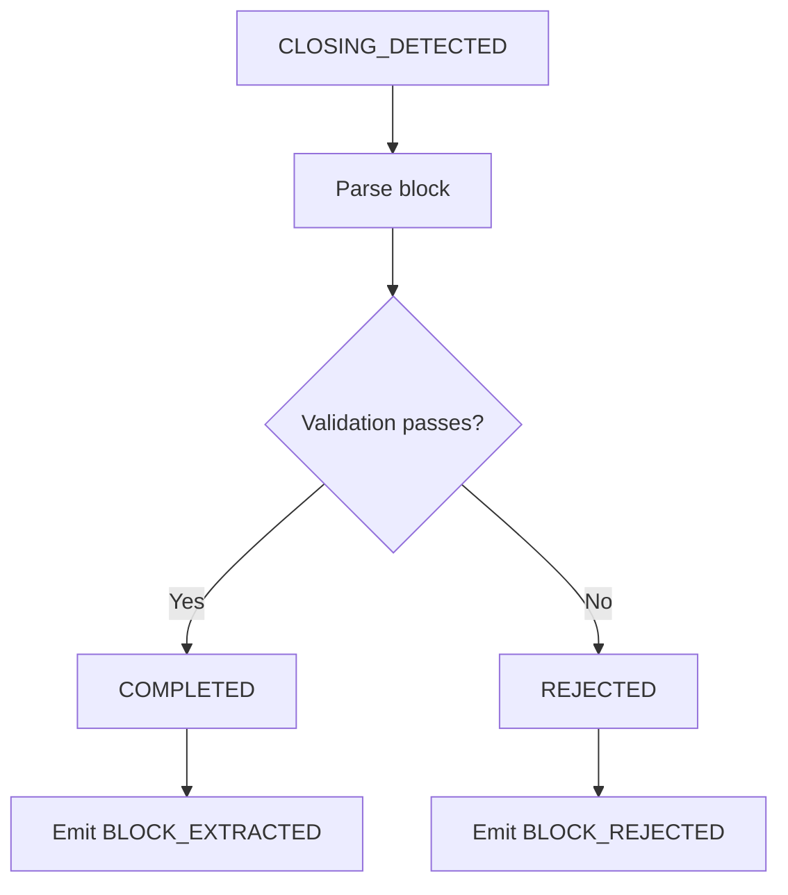
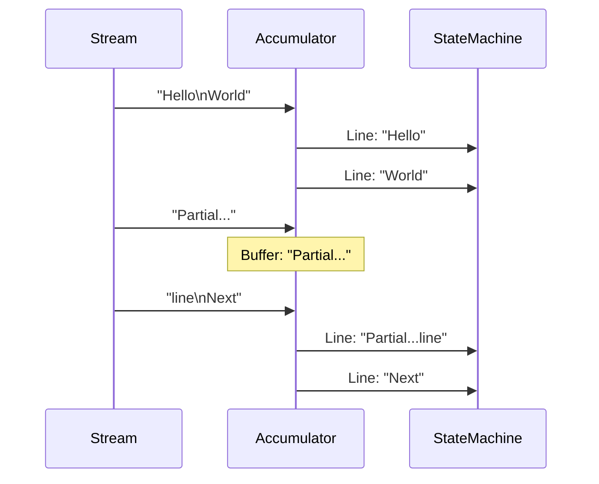
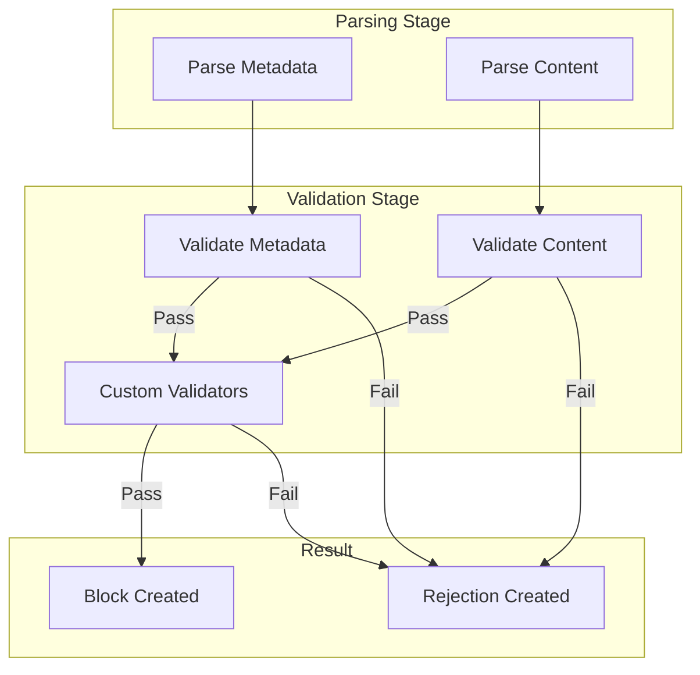

# Block State Machine

Streamblocks uses a state machine to track block detection and extraction. This document explains the states, transitions, and internal workings of the block processing system.

## State Overview



## States

### SEARCHING

The initial and default state. The processor scans lines looking for block start markers.

```python
# In SEARCHING state, each line is checked for block start
if syntax.detect_start(line):
    state = BlockState.HEADER_DETECTED
    emit(EventType.BLOCK_OPENED)
else:
    emit(EventType.TEXT_DELTA)  # Regular text
```

**Transitions from SEARCHING:**

| Condition | Next State | Event |
|-----------|------------|-------|
| Start marker found | HEADER_DETECTED | BLOCK_OPENED |
| Regular line | SEARCHING | TEXT_DELTA |
| Stream ends | Terminal | STREAM_END |

### HEADER_DETECTED

A block start marker has been found. The processor determines if frontmatter parsing is needed.



**Transitions from HEADER_DETECTED:**

| Condition | Next State | Event |
|-----------|------------|-------|
| Has frontmatter | ACCUMULATING_METADATA | - |
| No frontmatter | ACCUMULATING_CONTENT | - |
| Invalid header | REJECTED | BLOCK_REJECTED |

### ACCUMULATING_METADATA

Collecting YAML frontmatter lines until the metadata section ends.

```python
# Frontmatter is collected until closing delimiter
if line.strip() == "---":  # Frontmatter end
    metadata = parse_yaml(frontmatter_lines)
    state = BlockState.ACCUMULATING_CONTENT
else:
    frontmatter_lines.append(line)
```

**Transitions from ACCUMULATING_METADATA:**

| Condition | Next State | Event |
|-----------|------------|-------|
| Metadata end marker | ACCUMULATING_CONTENT | - |
| Invalid YAML | REJECTED | BLOCK_REJECTED |
| Stream ends | REJECTED | BLOCK_REJECTED |

### ACCUMULATING_CONTENT

Collecting block content lines until an end marker is found.

```python
# Content is accumulated until end marker
if syntax.detect_end(line):
    state = BlockState.CLOSING_DETECTED
elif len(content) > max_block_size:
    state = BlockState.REJECTED
else:
    content_lines.append(line)
    emit(EventType.BLOCK_CONTENT)
```

**Transitions from ACCUMULATING_CONTENT:**

| Condition | Next State | Event |
|-----------|------------|-------|
| End marker found | CLOSING_DETECTED | - |
| Max size exceeded | REJECTED | BLOCK_REJECTED |
| Regular line | ACCUMULATING_CONTENT | BLOCK_CONTENT |
| Stream ends | REJECTED | BLOCK_REJECTED |

### CLOSING_DETECTED

An end marker has been found. The complete block is validated.



**Transitions from CLOSING_DETECTED:**

| Condition | Next State | Event |
|-----------|------------|-------|
| Validation passes | COMPLETED | BLOCK_EXTRACTED |
| Validation fails | REJECTED | BLOCK_REJECTED |

### COMPLETED

Block successfully extracted. Returns to searching for next block.

```python
# Block is complete and valid
block = Block(metadata=metadata, content=content)
emit(EventType.BLOCK_EXTRACTED, block=block)
state = BlockState.SEARCHING
```

### REJECTED

Block was rejected due to validation failure or other error.

```python
# Block was rejected
rejection = BlockRejection(
    reason=error_code,
    message="Validation failed",
    partial_content=content_so_far,
)
emit(EventType.BLOCK_REJECTED, rejection=rejection)
state = BlockState.SEARCHING
```

## Block Candidate

During accumulation, the processor builds a `BlockCandidate`:

```python
@dataclass
class BlockCandidate:
    """Represents a block being accumulated."""

    start_line: int          # Line where block started
    header_line: str         # The header line content
    metadata_lines: list[str]  # Frontmatter lines (if any)
    content_lines: list[str]  # Content lines
    syntax: Syntax           # Syntax being used

    @property
    def total_size(self) -> int:
        """Total accumulated size in characters."""
        return sum(len(line) for line in self.content_lines)
```

## Line Accumulation

Text arrives as chunks that may not align with line boundaries:



```python
class LineAccumulator:
    """Accumulates chunks into complete lines."""

    def __init__(self):
        self.buffer = ""

    def add_chunk(self, chunk: str) -> list[str]:
        """Add a chunk and return complete lines."""
        self.buffer += chunk
        lines = []

        while "\n" in self.buffer:
            line, self.buffer = self.buffer.split("\n", 1)
            lines.append(line)

        return lines

    def flush(self) -> str | None:
        """Flush remaining buffer at stream end."""
        if self.buffer:
            line = self.buffer
            self.buffer = ""
            return line
        return None
```

## Syntax Detection

Each syntax defines how to detect block boundaries:

### Delimiter Preamble

```
!!block01:task
Do something important
!!end
```

```python
class DelimiterPreambleSyntax:
    START_PATTERN = re.compile(r"^!!(\w+):(\w+)\s*$")
    END_PATTERN = re.compile(r"^!!end\s*$")

    def detect_start(self, line: str) -> bool:
        return bool(self.START_PATTERN.match(line))

    def detect_end(self, line: str) -> bool:
        return bool(self.END_PATTERN.match(line))
```

### Delimiter Frontmatter

```
!!block01
---
type: task
priority: high
---
Do something important
!!end
```

### Markdown Frontmatter

````
```block01
---
type: task
---
Do something important
```
````

## Validation Pipeline



### Metadata Validation

```python
class MetadataValidator:
    """Validates block metadata."""

    def validate(self, metadata: dict) -> ValidationResult:
        # Required fields
        if "id" not in metadata:
            return ValidationResult.failure("Missing required field: id")

        # Type checking
        if not isinstance(metadata.get("type"), str):
            return ValidationResult.failure("Field 'type' must be string")

        return ValidationResult.success()
```

### Content Validation

```python
class ContentValidator:
    """Validates block content."""

    def validate(self, content: str, block_type: str) -> ValidationResult:
        # Type-specific validation
        if block_type == "json":
            try:
                json.loads(content)
            except json.JSONDecodeError as e:
                return ValidationResult.failure(f"Invalid JSON: {e}")

        return ValidationResult.success()
```

## Error Handling

### BlockErrorCode

```python
class BlockErrorCode(Enum):
    """Error codes for block rejection."""

    INVALID_HEADER = "invalid_header"
    INVALID_METADATA = "invalid_metadata"
    INVALID_CONTENT = "invalid_content"
    VALIDATION_FAILED = "validation_failed"
    MAX_SIZE_EXCEEDED = "max_size_exceeded"
    UNCLOSED_BLOCK = "unclosed_block"
    UNKNOWN_BLOCK_TYPE = "unknown_block_type"
```

### BlockRejection

```python
@dataclass
class BlockRejection:
    """Information about a rejected block."""

    reason: BlockErrorCode
    message: str
    partial_content: str | None = None
    line_number: int | None = None
```

## Processing Configuration

Configure state machine behavior:

```python
processor = StreamBlockProcessor(
    registry=registry,
    syntax=syntax,
    max_block_size=100_000,       # Max content size
    emit_text_deltas=True,        # Emit TEXT_DELTA events
    emit_block_content=True,      # Emit BLOCK_CONTENT events
    emit_original_events=False,   # Emit original provider events
)
```

## Next Steps

- [Adapter Protocol](adapters.md) - Input/output adapters
- [Extension System](extensions.md) - Provider extensions
- [Events](../events.md) - Event system details
