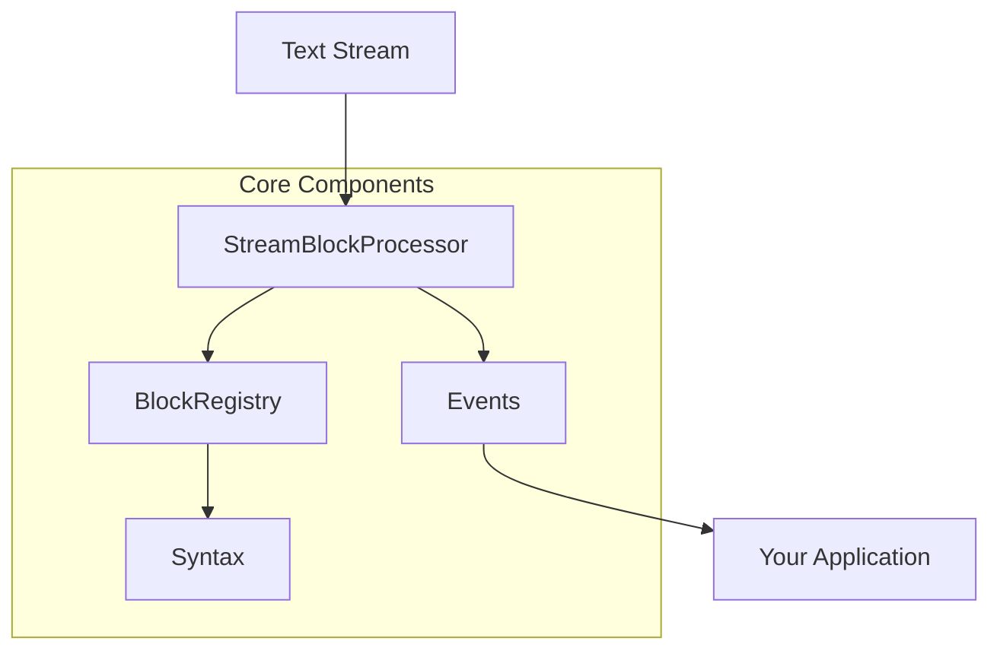
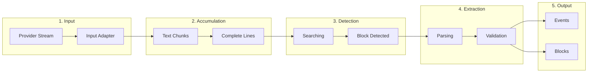

# Basics

This guide covers the fundamental concepts of Streamblocks. Understanding these concepts is essential for effectively using the library.

## Core Components

Streamblocks is built around four core components that work together:



### StreamBlockProcessor

The central engine that processes text streams and extracts blocks:

```python
from streamblocks import StreamBlockProcessor, BlockRegistry, Syntax

# Create a processor
registry = BlockRegistry()
processor = StreamBlockProcessor(
    registry=registry,
    syntax=Syntax.DELIMITER_PREAMBLE,
)

# Process a stream
async for event in processor.process_stream(stream):
    handle_event(event)
```

**Key responsibilities:**

- Receives text chunks from adapted streams
- Accumulates lines for block detection
- Manages block state transitions
- Emits events for each processing stage
- Coordinates validation and output

### BlockRegistry

Manages registered block types and their handlers:

```python
from streamblocks import BlockRegistry
from streamblocks.blocks import TaskBlock, CodeBlock, MessageBlock

# Create registry with built-in blocks
registry = BlockRegistry()

# Register custom blocks
registry.register(TaskBlock)
registry.register(CodeBlock, priority=10)  # Higher priority
registry.register(MessageBlock)

# Look up block by type
block_class = registry.get_block("task")
```

**Key responsibilities:**

- Stores metadata and content class mappings
- Provides priority-based type resolution
- Supports custom block type registration
- Handles default block fallback

### Syntax

Defines how blocks are detected and parsed from text:

```python
from streamblocks import Syntax

# Built-in syntaxes
Syntax.DELIMITER_PREAMBLE      # !!id:type\ncontent\n!!end
Syntax.DELIMITER_FRONTMATTER   # !!id\n---\nyaml\n---\ncontent\n!!end
Syntax.MARKDOWN_FRONTMATTER    # ```id\n---\nyaml\n---\ncontent\n```
```

### Events

Real-time notifications about processing state:

```python
from streamblocks import EventType

async for event in processor.process_stream(stream):
    match event.type:
        case EventType.STREAM_START:
            print("Stream started")
        case EventType.TEXT_DELTA:
            print(f"Text: {event.text}")
        case EventType.BLOCK_OPENED:
            print(f"Block started: {event.block_id}")
        case EventType.BLOCK_EXTRACTED:
            print(f"Block complete: {event.block}")
        case EventType.STREAM_END:
            print("Stream ended")
```

## Block Model

A block represents a structured unit of content extracted from a text stream.

### Block Structure

```python
from streamblocks import Block, BaseMetadata, BaseContent

# A block consists of:
# - metadata: Parsed from header/frontmatter
# - content: The block body

block = Block(
    metadata=TaskMetadata(
        id="task01",
        block_type="task",
        priority="high",
    ),
    content=TaskContent(
        raw_content="Implement the feature",
    ),
)

# Access block data
print(block.metadata.id)          # "task01"
print(block.metadata.block_type)  # "task"
print(block.content.raw_content)  # "Implement the feature"
```

### Metadata

Block metadata is parsed from the header or frontmatter:

```python
from streamblocks import BaseMetadata
from typing import Literal

class TaskMetadata(BaseMetadata):
    """Metadata for task blocks."""

    block_type: Literal["task"] = "task"
    priority: str = "normal"
    assignee: str | None = None
    due_date: str | None = None
```

**Required fields:**

- `id`: Unique identifier for the block
- `block_type`: Type discriminator for routing

**Optional fields:**

- Any additional fields you define
- Validated by Pydantic

### Content

Block content holds the parsed body:

```python
from streamblocks import BaseContent

class TaskContent(BaseContent):
    """Content for task blocks."""

    @classmethod
    def parse(cls, raw_text: str) -> "TaskContent":
        """Parse raw text into content."""
        # Custom parsing logic
        return cls(raw_content=raw_text.strip())
```

## Processing Pipeline

Understanding the processing pipeline helps you build effective applications:



### Step 1: Input Adaptation

Provider-specific streams are normalized to text chunks:

```python
# Raw Gemini stream
async for chunk in gemini_response:
    # chunk is GenerateContentResponse

# Adapted to text
async for text in adapted_stream:
    # text is a string
```

### Step 2: Line Accumulation

Text chunks are accumulated into complete lines:

```python
# Chunks may split across lines
chunk1 = "Hello, wo"
chunk2 = "rld!\nHow are"
chunk3 = " you?\n"

# Accumulated into lines
line1 = "Hello, world!"
line2 = "How are you?"
```

### Step 3: Block Detection

Lines are scanned for block start/end markers:

```python
# Delimiter Preamble syntax
"!!task01:task"      # Start detected
"Do something"       # Content
"!!end"              # End detected
```

### Step 4: Block Extraction

Complete blocks are parsed and validated:

```python
# Parsing
metadata = parse_metadata(header_line)
content = parse_content(content_lines)

# Validation
validate_metadata(metadata)
validate_content(content)

# Block creation
block = Block(metadata=metadata, content=content)
```

### Step 5: Event Emission

Events are emitted for each stage:

```python
# Events throughout processing
STREAM_START      # Stream begins
TEXT_DELTA        # Text chunk received
BLOCK_OPENED      # Block start detected
BLOCK_CONTENT     # Content accumulated
BLOCK_EXTRACTED   # Block complete and valid
BLOCK_REJECTED    # Block failed validation
STREAM_END        # Stream complete
```

## Configuration Options

### Processor Configuration

```python
processor = StreamBlockProcessor(
    registry=registry,
    syntax=Syntax.DELIMITER_PREAMBLE,

    # Event emission
    emit_text_deltas=True,       # Emit TEXT_DELTA events
    emit_block_content=True,     # Emit BLOCK_CONTENT events
    emit_original_events=False,  # Emit original provider events

    # Limits
    max_block_size=100_000,      # Max content size in chars

    # Adapters
    input_adapter="auto",        # Auto-detect adapter
    output_adapter=None,         # Optional output transformation

    # Logging
    logger=my_logger,            # Custom logger
)
```

### Registry Configuration

```python
registry = BlockRegistry()

# Register with priority (higher = checked first)
registry.register(HighPriorityBlock, priority=100)
registry.register(NormalBlock, priority=50)
registry.register(FallbackBlock, priority=1)

# Set default block for unknown types
registry.set_default(GenericBlock)
```

## Basic Usage Patterns

### Pattern 1: Simple Extraction

Extract all blocks from a stream:

```python
from streamblocks import StreamBlockProcessor, BlockRegistry, Syntax, EventType

async def extract_blocks(stream):
    registry = BlockRegistry()
    processor = StreamBlockProcessor(
        registry=registry,
        syntax=Syntax.DELIMITER_PREAMBLE,
    )

    blocks = []
    async for event in processor.process_stream(stream):
        if event.type == EventType.BLOCK_EXTRACTED:
            blocks.append(event.block)

    return blocks
```

### Pattern 2: Real-time Processing

Process blocks as they complete:

```python
async def process_realtime(stream):
    registry = BlockRegistry()
    processor = StreamBlockProcessor(
        registry=registry,
        syntax=Syntax.DELIMITER_PREAMBLE,
        emit_text_deltas=True,
    )

    async for event in processor.process_stream(stream):
        match event.type:
            case EventType.TEXT_DELTA:
                # Show text as it arrives
                display_text(event.text)

            case EventType.BLOCK_OPENED:
                # Block started - prepare UI
                show_block_placeholder(event.block_id)

            case EventType.BLOCK_EXTRACTED:
                # Block complete - render it
                render_block(event.block)

            case EventType.BLOCK_REJECTED:
                # Block failed - show error
                show_error(event.rejection.message)
```

### Pattern 3: Type-Specific Handling

Route blocks by type:

```python
async def handle_by_type(stream):
    registry = BlockRegistry()
    processor = StreamBlockProcessor(
        registry=registry,
        syntax=Syntax.DELIMITER_PREAMBLE,
    )

    async for event in processor.process_stream(stream):
        if event.type == EventType.BLOCK_EXTRACTED:
            block = event.block

            match block.metadata.block_type:
                case "task":
                    await handle_task(block)
                case "code":
                    await handle_code(block)
                case "message":
                    await handle_message(block)
                case _:
                    await handle_unknown(block)
```

### Pattern 4: Error Handling

Handle errors gracefully:

```python
async def process_with_errors(stream):
    registry = BlockRegistry()
    processor = StreamBlockProcessor(
        registry=registry,
        syntax=Syntax.DELIMITER_PREAMBLE,
    )

    extracted = 0
    rejected = 0

    async for event in processor.process_stream(stream):
        match event.type:
            case EventType.BLOCK_EXTRACTED:
                extracted += 1
                await process_block(event.block)

            case EventType.BLOCK_REJECTED:
                rejected += 1
                await log_rejection(event.rejection)

            case EventType.STREAM_END:
                print(f"Complete: {extracted} extracted, {rejected} rejected")
```

## Text vs Blocks

Streamblocks distinguishes between regular text and structured blocks:

```
This is regular text that passes through.

!!task01:task
This is block content that gets extracted.
!!end

More regular text here.
```

With `emit_text_deltas=True`:

```python
# Events emitted:
TEXT_DELTA: "This is regular text that passes through.\n"
TEXT_DELTA: "\n"
BLOCK_OPENED: block_id="task01"
BLOCK_CONTENT: "This is block content that gets extracted."
BLOCK_EXTRACTED: Block(...)
TEXT_DELTA: "\n"
TEXT_DELTA: "More regular text here.\n"
```

## Memory Considerations

Streamblocks is designed for efficient streaming:

- **No full buffering**: Text is processed line-by-line
- **Events emitted immediately**: As soon as detection is complete
- **Block size limits**: Configurable maximum to prevent memory issues

```python
# Limit block size
processor = StreamBlockProcessor(
    registry=registry,
    syntax=syntax,
    max_block_size=50_000,  # Reject blocks larger than 50KB
)

async for event in processor.process_stream(stream):
    if event.type == EventType.BLOCK_REJECTED:
        if event.rejection.reason == BlockErrorCode.MAX_SIZE_EXCEEDED:
            print("Block too large, skipping")
```

## Next Steps

- [Stream Processing](processing.md) - Deep dive into processing
- [Syntaxes](syntaxes.md) - Syntax formats in detail
- [Adapters](adapters.md) - Working with LLM providers
- [Block Types](blocks.md) - Creating custom blocks
- [Events](events.md) - Event system details
