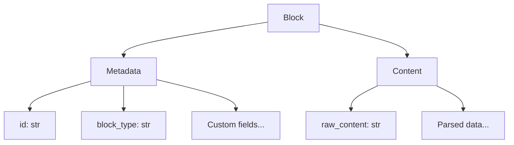
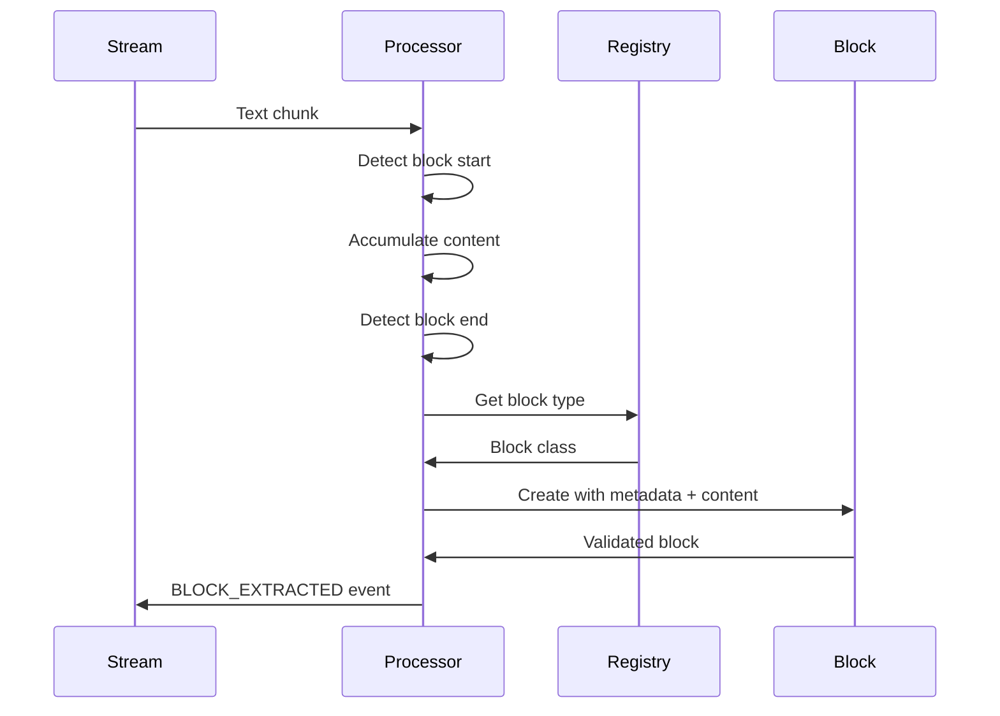

# Block Types

Blocks are structured units of content extracted from text streams. This guide covers the block model, built-in types, and creating custom blocks.

## Block Structure

Every block has two components:



### Block Class

```python
from streamblocks import Block

block = Block(
    metadata=TaskMetadata(id="task01", block_type="task"),
    content=TaskContent(raw_content="Implement feature"),
)

# Access data
block.metadata.id          # "task01"
block.metadata.block_type  # "task"
block.content.raw_content  # "Implement feature"
```

## Metadata

Metadata is parsed from the block header or frontmatter.

### BaseMetadata

All metadata classes inherit from `BaseMetadata`:

```python
from streamblocks import BaseMetadata
from typing import Literal

class BaseMetadata:
    """Base class for block metadata."""

    id: str              # Required: unique identifier
    block_type: str      # Required: type discriminator
```

### Custom Metadata

Create custom metadata with additional fields:

```python
from streamblocks import BaseMetadata
from typing import Literal

class TaskMetadata(BaseMetadata):
    """Metadata for task blocks."""

    block_type: Literal["task"] = "task"
    priority: str = "normal"
    assignee: str | None = None
    due_date: str | None = None
    tags: list[str] = []

class CodeMetadata(BaseMetadata):
    """Metadata for code blocks."""

    block_type: Literal["code"] = "code"
    language: str = "python"
    filename: str | None = None
    line_start: int | None = None
```

### Metadata Validation

Pydantic validates metadata automatically:

```python
from pydantic import field_validator

class TaskMetadata(BaseMetadata):
    block_type: Literal["task"] = "task"
    priority: str = "normal"

    @field_validator("priority")
    @classmethod
    def validate_priority(cls, v: str) -> str:
        valid = {"low", "normal", "high", "critical"}
        if v not in valid:
            raise ValueError(f"priority must be one of {valid}")
        return v
```

## Content

Content holds the parsed block body.

### BaseContent

All content classes inherit from `BaseContent`:

```python
from streamblocks import BaseContent

class BaseContent:
    """Base class for block content."""

    raw_content: str  # The raw text content

    @classmethod
    def parse(cls, raw_text: str) -> "BaseContent":
        """Parse raw text into content."""
        return cls(raw_content=raw_text)
```

### Custom Content

Create content classes with custom parsing:

```python
from streamblocks import BaseContent
import json

class JSONContent(BaseContent):
    """Content parsed as JSON."""

    data: dict | list | None = None

    @classmethod
    def parse(cls, raw_text: str) -> "JSONContent":
        try:
            data = json.loads(raw_text)
        except json.JSONDecodeError:
            data = None

        return cls(raw_content=raw_text, data=data)

class MarkdownContent(BaseContent):
    """Content with Markdown parsing."""

    title: str | None = None
    sections: list[str] = []

    @classmethod
    def parse(cls, raw_text: str) -> "MarkdownContent":
        lines = raw_text.strip().split("\n")

        # Extract title (first # heading)
        title = None
        for line in lines:
            if line.startswith("# "):
                title = line[2:].strip()
                break

        # Extract sections (## headings)
        sections = [
            line[3:].strip()
            for line in lines
            if line.startswith("## ")
        ]

        return cls(raw_content=raw_text, title=title, sections=sections)
```

## Block Definition

Combine metadata and content into a block type:

```python
from streamblocks import Block, BaseMetadata, BaseContent
from typing import Literal

# 1. Define metadata
class TaskMetadata(BaseMetadata):
    block_type: Literal["task"] = "task"
    priority: str = "normal"
    assignee: str | None = None

# 2. Define content
class TaskContent(BaseContent):
    @classmethod
    def parse(cls, raw_text: str) -> "TaskContent":
        return cls(raw_content=raw_text.strip())

# 3. Define block type alias
TaskBlock = Block[TaskMetadata, TaskContent]
```

## Block Registry

The registry maps block types to their definitions:

```python
from streamblocks import BlockRegistry

registry = BlockRegistry()

# Register block types
registry.register(TaskBlock)
registry.register(CodeBlock, priority=10)  # Higher priority
registry.register(MessageBlock)

# With custom type name
registry.register(TaskBlock, type_name="todo")
```

### Priority

Higher priority blocks are matched first:

```python
registry.register(HighPriorityBlock, priority=100)
registry.register(NormalBlock, priority=50)
registry.register(FallbackBlock, priority=1)

# If multiple blocks match, HighPriorityBlock is used
```

### Default Block

Set a fallback for unknown types:

```python
registry.set_default(GenericBlock)

# Now unknown types use GenericBlock instead of being rejected
```

## Built-in Block Types

Streamblocks provides common block types:

### GenericBlock

Default block for any content:

```python
from streamblocks.blocks import GenericBlock

# Works with any metadata
block = GenericBlock(
    metadata=BaseMetadata(id="gen01", block_type="unknown"),
    content=BaseContent(raw_content="Any content"),
)
```

### TextBlock

Plain text content:

```python
from streamblocks.blocks import TextBlock

block = TextBlock(
    metadata=TextMetadata(id="text01", block_type="text"),
    content=TextContent(raw_content="Plain text here"),
)
```

## Creating Custom Blocks

### Step-by-Step

```python
from streamblocks import Block, BaseMetadata, BaseContent, BlockRegistry
from typing import Literal
from pydantic import field_validator

# Step 1: Define metadata
class ReviewMetadata(BaseMetadata):
    """Metadata for code review blocks."""

    block_type: Literal["review"] = "review"
    file_path: str
    line_start: int
    line_end: int | None = None
    severity: str = "info"

    @field_validator("severity")
    @classmethod
    def validate_severity(cls, v: str) -> str:
        valid = {"info", "warning", "error"}
        if v not in valid:
            raise ValueError(f"severity must be one of {valid}")
        return v

# Step 2: Define content
class ReviewContent(BaseContent):
    """Content for code review blocks."""

    suggestion: str | None = None
    code_snippet: str | None = None

    @classmethod
    def parse(cls, raw_text: str) -> "ReviewContent":
        lines = raw_text.strip().split("\n")

        suggestion = None
        code_lines = []

        in_code = False
        for line in lines:
            if line.startswith("```"):
                in_code = not in_code
            elif in_code:
                code_lines.append(line)
            else:
                if suggestion is None:
                    suggestion = line

        return cls(
            raw_content=raw_text,
            suggestion=suggestion,
            code_snippet="\n".join(code_lines) if code_lines else None,
        )

# Step 3: Create block type
ReviewBlock = Block[ReviewMetadata, ReviewContent]

# Step 4: Register
registry = BlockRegistry()
registry.register(ReviewBlock)
```

### Using the Custom Block

```
!!review01
---
type: review
file_path: src/main.py
line_start: 42
severity: warning
---
Consider using a context manager here.

```python
# Instead of:
f = open("file.txt")
f.close()

# Use:
with open("file.txt") as f:
    ...
```
!!end
```

## Block Lifecycle



## Block Validation

Blocks are validated during creation:

### Metadata Validation

```python
class TaskMetadata(BaseMetadata):
    block_type: Literal["task"] = "task"
    priority: str = "normal"

    @field_validator("priority")
    @classmethod
    def validate_priority(cls, v: str) -> str:
        if v not in {"low", "normal", "high"}:
            raise ValueError("Invalid priority")
        return v
```

### Content Validation

```python
class JSONContent(BaseContent):
    data: dict | None = None

    @model_validator(mode="after")
    def validate_json(self) -> "JSONContent":
        if self.raw_content and self.data is None:
            raise ValueError("Content must be valid JSON")
        return self
```

### Handling Validation Failures

```python
async for event in processor.process_stream(stream):
    if event.type == EventType.BLOCK_REJECTED:
        rejection = event.rejection

        if rejection.reason == BlockErrorCode.VALIDATION_FAILED:
            print(f"Validation error: {rejection.message}")
```

## Block Serialization

### To Dictionary

```python
block_dict = block.model_dump()
# {
#     "metadata": {"id": "task01", "block_type": "task", ...},
#     "content": {"raw_content": "...", ...}
# }
```

### To JSON

```python
block_json = block.model_dump_json()
# '{"metadata": {...}, "content": {...}}'
```

### From Dictionary

```python
block = Block.model_validate(block_dict)
```

## Best Practices

!!! tip "Keep Metadata Simple"
    Put complex data in content, not metadata. Metadata should be quick to parse.

!!! tip "Validate Early"
    Use Pydantic validators to catch errors during parsing, not later.

!!! tip "Use Literal Types"
    Use `Literal["type"]` for block_type to enable type checking.

!!! tip "Document Block Formats"
    Include examples in your block class docstrings.

## Next Steps

- [Validation](validation.md) - Validation system details
- [Events](events.md) - Block events
- [Patterns](patterns.md) - Common usage patterns
