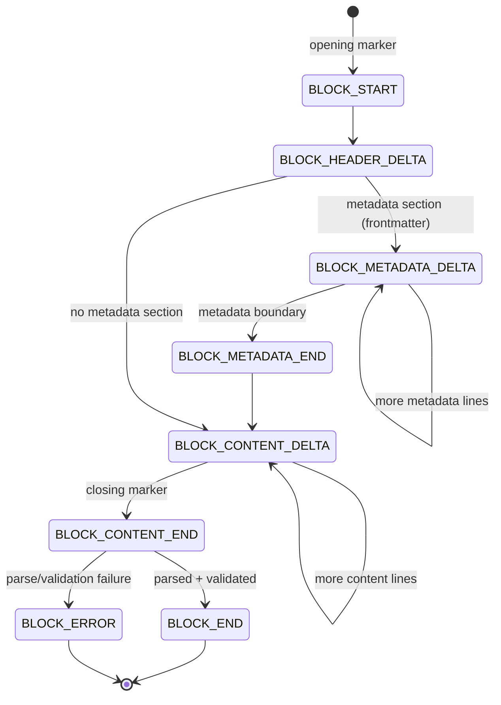

# Events

Everything the processor sees becomes an event: stream lifecycle, text outside blocks, and every stage of a block's life. This page is the authoritative map of the event model.

## Consuming events

All events are immutable Pydantic models deriving from `BaseEvent`. The `Event` type is a discriminated union (on the `type` field) of every concrete event class, so the idiomatic consumption pattern is one `isinstance` check per class you care about:

```python
--8<-- "src/hother/streamblocks_examples/03_adapters/14_section_delta_events.py:example"
```

[View source on GitHub](https://github.com/hotherio/streamblocks/tree/main/src/hother/streamblocks_examples/03_adapters/14_section_delta_events.py)

Every event shares three fields from `BaseEvent`:

| Field | Type | Meaning |
|-------|------|---------|
| `timestamp` | `int` | Unix timestamp in milliseconds, auto-generated |
| `event_id` | `str` | Unique identifier (UUID), auto-generated |
| `raw_event` | `Any \| None` | Original provider event, preserved by [adapters](adapters.md) |

!!! note "Native provider events in the stream"
    `StreamBlockProcessor.process_stream()` yields `TChunk | Event`: when `emit_original_events=True` (the default), the original provider chunks are interleaved with StreamBlocks events. Use `processor.is_native_event(event)` to tell them apart without coupling to a provider.

## Event catalog

All values of the `EventType` enum, with the event class that carries each:

| `EventType` | Event class | Emitted when |
|-------------|-------------|--------------|
| `STREAM_STARTED` | `StreamStartedEvent` | Stream processing begins |
| `STREAM_FINISHED` | `StreamFinishedEvent` | Stream completes; carries `blocks_extracted`, `blocks_rejected`, `total_events`, `duration_ms` |
| `STREAM_ERROR` | `StreamErrorEvent` | Stream processing fails |
| `TEXT_CONTENT` | `TextContentEvent` | A complete line outside any block |
| `TEXT_DELTA` | `TextDeltaEvent` | A raw text chunk, in real time, before line completion |
| `BLOCK_START` | `BlockStartEvent` | Block opening marker detected |
| `BLOCK_HEADER_DELTA` | `BlockHeaderDeltaEvent` | Content added to the header section; may carry `inline_metadata` |
| `BLOCK_METADATA_DELTA` | `BlockMetadataDeltaEvent` | Content added to the metadata section; `is_boundary` flags boundary lines |
| `BLOCK_CONTENT_DELTA` | `BlockContentDeltaEvent` | Content added to the content section |
| `BLOCK_METADATA_END` | `BlockMetadataEndEvent` | Metadata section complete and parsed, before content begins |
| `BLOCK_CONTENT_END` | `BlockContentEndEvent` | Content section complete and parsed, before final extraction |
| `BLOCK_END` | `BlockEndEvent` | Block extracted and validated; `get_block()` returns the typed `ExtractedBlock` |
| `BLOCK_ERROR` | `BlockErrorEvent` | Block extraction failed; `error_code` is a `BlockErrorCode` |
| `CUSTOM` | `CustomEvent` | Application-specific events (`name` + `value` dict) |

`BlockErrorEvent.error_code` values (`VALIDATION_FAILED`, `SIZE_EXCEEDED`, `UNCLOSED_BLOCK`, `UNKNOWN_TYPE`, `PARSE_FAILED`, `MISSING_METADATA`, `MISSING_CONTENT`, `SYNTAX_ERROR`) are covered in the [Error Handling guide](../guides/error-handling.md).

## Block lifecycle ordering

For each block, events arrive in a fixed order. Which sections appear depends on the [syntax](syntaxes.md): frontmatter syntaxes have a metadata section, the preamble syntax carries metadata inline in the header.



A block can also fail earlier, for example `BLOCK_ERROR` with `UNCLOSED_BLOCK` at end of stream, or with `VALIDATION_FAILED` right after `BLOCK_METADATA_END` when early metadata validation aborts the block.

## Block start: act before content arrives

`BlockStartEvent` fires as soon as the opening marker is detected, before any content. Use it to create UI elements or allocate resources early:

```python
--8<-- "src/hother/streamblocks_examples/03_adapters/07_block_opened_event.py:example"
```

[View source on GitHub](https://github.com/hotherio/streamblocks/tree/main/src/hother/streamblocks_examples/03_adapters/07_block_opened_event.py)

## Text deltas: character-level streaming

`TextDeltaEvent` is emitted immediately as text arrives, before lines complete. Each delta knows whether it is inside a block (`inside_block`, `block_id`) and which `section` it belongs to, ideal for typewriter effects and live UIs:

```python
--8<-- "src/hother/streamblocks_examples/03_adapters/06_text_delta_streaming.py:example"
```

[View source on GitHub](https://github.com/hotherio/streamblocks/tree/main/src/hother/streamblocks_examples/03_adapters/06_text_delta_streaming.py)

## Section end events: early validation

`BlockMetadataEndEvent` and `BlockContentEndEvent` fire when a section completes, carrying the raw and parsed section plus `validation_passed` / `validation_error`. This lets you validate metadata and react before the block finishes streaming:

```python
--8<-- "src/hother/streamblocks_examples/03_adapters/15_section_end_events.py:metadata_end"
```

Combined with `MetadataValidationFailureMode.ABORT_BLOCK`, a failing metadata validator aborts the block as soon as the metadata section closes; see the [Validation guide](../guides/validation.md).

[View source on GitHub](https://github.com/hotherio/streamblocks/tree/main/src/hother/streamblocks_examples/03_adapters/15_section_end_events.py)

## Controlling event volume

Three `ProcessorConfig` flags gate event emission (all default to `True`):

| Flag | Gates | Disable when |
|------|-------|--------------|
| `emit_original_events` | Passthrough of native provider chunks | You only need StreamBlocks events |
| `emit_text_deltas` | `TextDeltaEvent` | Batch processing; line-level events suffice |
| `emit_section_end_events` | `BlockMetadataEndEvent`, `BlockContentEndEvent` | No early validation needed |

```python
--8<-- "src/hother/streamblocks_examples/03_adapters/15_section_end_events.py:optout"
```

See [Performance Tuning](../guides/performance.md) for the trade-offs, and the [configuration flags example](https://github.com/hotherio/streamblocks/tree/main/src/hother/streamblocks_examples/03_adapters/08_configuration_flags.py) for all combinations in action.

## Next steps

- [Adapters](adapters.md): how provider chunks become text and events.
- [Error Handling](../guides/error-handling.md): reacting to `BlockErrorEvent` codes.
- [Events reference](../reference/events.md): full API of every event class.
