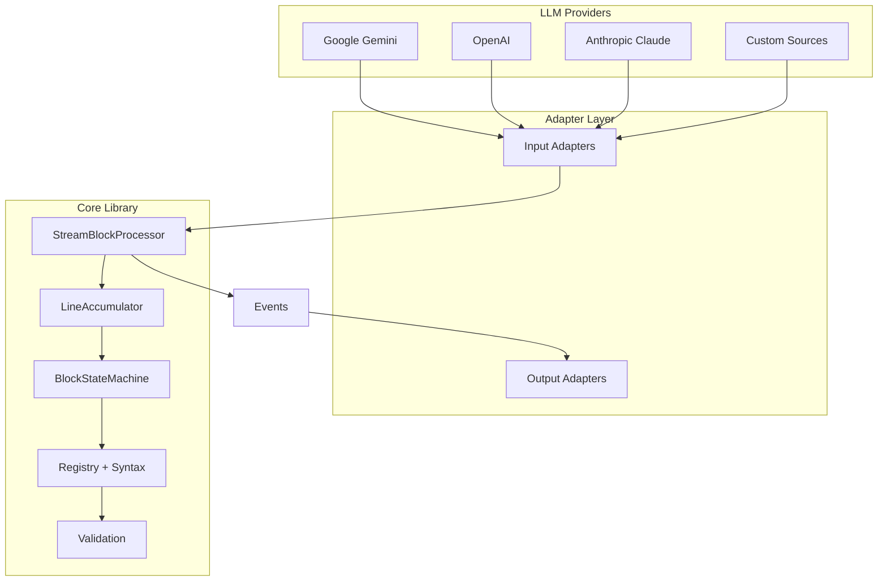
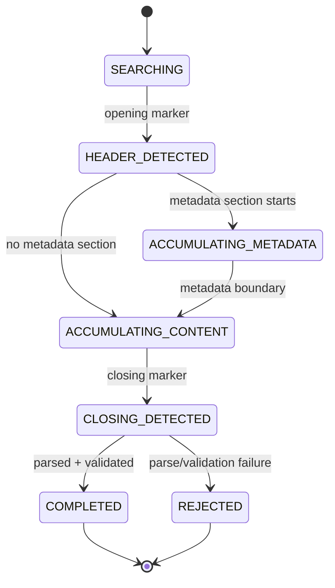

# Architecture

StreamBlocks turns a raw text stream into typed, validated blocks through a fixed pipeline. This page explains the moving parts; the rest of the Concepts section covers each in depth.

## System overview



## The pipeline, step by step

1. **Adapter detection** — on the first chunk, the input adapter is auto-detected (or you pass one explicitly). Adapters extract text from provider-specific event objects and categorize everything else as passthrough or skip. See [Adapters](adapters.md).
2. **Line accumulation** — `LineAccumulator` buffers incoming text chunks and yields complete lines. Block detection is line-based.
3. **Block detection** — `BlockStateMachine` feeds each line to the registry's [syntax](syntaxes.md), which reports openings, closings, and metadata boundaries.
4. **Candidate accumulation** — between an opening and its closing, lines accumulate in a `BlockCandidate` that tracks the current section (header → metadata → content).
5. **Parsing** — when the block closes, the syntax's `parse_block()` turns the accumulated lines into the typed metadata and content models registered for that `block_type`. See [Blocks & Registry](blocks-and-registry.md).
6. **Validation** — registry validators run against metadata, content, or the whole block; failures reject the block with a specific error code. See the [Validation guide](../guides/validation.md).
7. **Event emission** — every stage emits [events](events.md): block start, per-section deltas, section ends, and finally `BlockEndEvent` (success) or `BlockErrorEvent` (failure). Text outside blocks flows through as text events.

## Block detection states

Internally, a candidate moves through `BlockState`:



Which sections exist depends on the syntax: the delimiter preamble syntax carries metadata inline in the opening line, while the frontmatter syntaxes have a dedicated YAML metadata section.

## Two processors

| Processor | Use when |
|-----------|----------|
| `StreamBlockProcessor` | You have one stream and one syntax; the common case. |
| `ProtocolStreamProcessor` | You consume protocol event streams (e.g. AG-UI) and want output adaptation back into that protocol. |

Both are async-first: `process_stream()` is an async generator, so blocks are delivered while upstream tokens are still arriving.

## Configuration

`ProcessorConfig` controls event volume and safety limits:

| Field | Default | Effect |
|-------|---------|--------|
| `lines_buffer` | 5 | Recent lines kept for error context |
| `max_line_length` | 16,384 | Lines longer than this are truncated |
| `max_block_size` | 1,048,576 (1 MB) | Larger blocks are rejected with `SIZE_EXCEEDED` |
| `emit_original_events` | `True` | Pass through original provider events |
| `emit_text_deltas` | `True` | Character-level `TextDeltaEvent` for live UIs |
| `emit_section_end_events` | `True` | `BlockMetadataEndEvent` / `BlockContentEndEvent` for early validation |
| `auto_detect_adapter` | `True` | Detect the input adapter from the first chunk |

```python
from hother.streamblocks import StreamBlockProcessor
from hother.streamblocks.core.processor import ProcessorConfig

config = ProcessorConfig(max_block_size=2_097_152, emit_text_deltas=False)
processor = StreamBlockProcessor(registry, config=config)
```

See [Performance Tuning](../guides/performance.md) for how these trade off.

## Next steps

- [Blocks & Registry](blocks-and-registry.md) — the typed block model.
- [Events](events.md) — everything the processor emits.
- [Syntaxes](syntaxes.md) — the wire formats.
