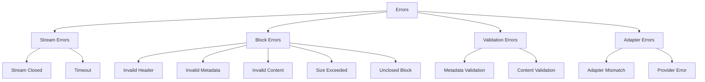

# Error Handling

Streamblocks provides comprehensive error handling for stream processing and block validation. This guide covers error types, handling patterns, and recovery strategies.

## Error Categories



## BlockErrorCode

Error codes for block rejection:

```python
from streamblocks import BlockErrorCode

class BlockErrorCode(Enum):
    """Error codes for block rejection."""

    # Header errors
    INVALID_HEADER = "invalid_header"

    # Metadata errors
    INVALID_METADATA = "invalid_metadata"

    # Content errors
    INVALID_CONTENT = "invalid_content"

    # Validation errors
    VALIDATION_FAILED = "validation_failed"

    # Size errors
    MAX_SIZE_EXCEEDED = "max_size_exceeded"

    # State errors
    UNCLOSED_BLOCK = "unclosed_block"

    # Registry errors
    UNKNOWN_BLOCK_TYPE = "unknown_block_type"
```

## BlockRejection

Information about rejected blocks:

```python
from streamblocks import BlockRejection

@dataclass
class BlockRejection:
    """Details about a rejected block."""

    reason: BlockErrorCode      # Error code
    message: str                # Human-readable message
    partial_content: str | None # Content accumulated before rejection
    line_number: int | None     # Line where error occurred
```

## Handling Block Rejections

### Basic Handling

```python
from streamblocks import EventType, BlockErrorCode

async for event in processor.process_stream(stream):
    if event.type == EventType.BLOCK_REJECTED:
        rejection = event.rejection
        print(f"Block rejected: {rejection.reason.value}")
        print(f"Message: {rejection.message}")
```

### Detailed Handling

```python
async for event in processor.process_stream(stream):
    if event.type == EventType.BLOCK_REJECTED:
        rejection = event.rejection

        match rejection.reason:
            case BlockErrorCode.INVALID_HEADER:
                logger.warning(f"Invalid header at line {rejection.line_number}")

            case BlockErrorCode.INVALID_METADATA:
                logger.warning(f"Metadata error: {rejection.message}")

            case BlockErrorCode.INVALID_CONTENT:
                logger.warning(f"Content error: {rejection.message}")

            case BlockErrorCode.VALIDATION_FAILED:
                logger.warning(f"Validation failed: {rejection.message}")

            case BlockErrorCode.MAX_SIZE_EXCEEDED:
                logger.warning("Block exceeded size limit")

            case BlockErrorCode.UNCLOSED_BLOCK:
                logger.warning("Block not closed before stream end")

            case BlockErrorCode.UNKNOWN_BLOCK_TYPE:
                logger.warning(f"Unknown type: {rejection.message}")
```

### Recovery with Partial Content

```python
async for event in processor.process_stream(stream):
    if event.type == EventType.BLOCK_REJECTED:
        rejection = event.rejection

        if rejection.partial_content:
            # Try to salvage something from the failed block
            logger.info(f"Partial content: {rejection.partial_content[:100]}...")

            # Maybe parse as plain text
            await handle_as_text(rejection.partial_content)
```

## Stream Errors

### Handling Stream Exceptions

```python
async def process_safely(stream):
    try:
        async for event in processor.process_stream(stream):
            await handle_event(event)

    except ConnectionError as e:
        logger.error(f"Connection lost: {e}")
        await reconnect_and_retry()

    except TimeoutError as e:
        logger.error(f"Stream timeout: {e}")
        await handle_timeout()

    except Exception as e:
        logger.error(f"Unexpected error: {e}")
        raise
```

### Retry Pattern

```python
import asyncio

async def process_with_retry(stream_factory, max_retries=3):
    for attempt in range(max_retries):
        try:
            stream = stream_factory()
            async for event in processor.process_stream(stream):
                await handle_event(event)
            return  # Success

        except ConnectionError as e:
            if attempt < max_retries - 1:
                wait = 2 ** attempt  # Exponential backoff
                logger.warning(f"Retry {attempt + 1} in {wait}s: {e}")
                await asyncio.sleep(wait)
            else:
                logger.error("Max retries exceeded")
                raise
```

## Validation Errors

### Pydantic Validation

```python
from pydantic import ValidationError

class TaskMetadata(BaseMetadata):
    block_type: Literal["task"] = "task"
    priority: str

    @field_validator("priority")
    @classmethod
    def validate_priority(cls, v: str) -> str:
        if v not in {"low", "normal", "high"}:
            raise ValueError(f"Invalid priority: {v}")
        return v

# When validation fails, BLOCK_REJECTED is emitted
# with reason=VALIDATION_FAILED
```

### Custom Validation Errors

```python
class StrictContent(BaseContent):
    @model_validator(mode="after")
    def validate_content(self) -> "StrictContent":
        if len(self.raw_content) < 10:
            raise ValueError("Content too short (minimum 10 chars)")

        if not self.raw_content.strip():
            raise ValueError("Content cannot be empty")

        return self
```

## Adapter Errors

### Handling Provider Errors

```python
async def process_gemini_stream(prompt):
    try:
        response = model.generate_content(prompt, stream=True)

        async for event in processor.process_stream(response):
            await handle_event(event)

    except google.api_core.exceptions.ResourceExhausted:
        logger.error("Gemini rate limit exceeded")
        await asyncio.sleep(60)
        # Retry...

    except google.api_core.exceptions.InvalidArgument as e:
        logger.error(f"Invalid request: {e}")
        raise
```

### Adapter Mismatch

```python
from streamblocks.ext.gemini import GeminiInputAdapter

# Using wrong adapter for stream type
processor = StreamBlockProcessor(
    registry=registry,
    syntax=syntax,
    input_adapter=GeminiInputAdapter(),  # Wrong for OpenAI stream
)

# Will fail to extract text from events
# Use input_adapter="auto" to avoid this
```

## Error Logging

### Structured Logging

```python
import structlog

logger = structlog.get_logger()

async for event in processor.process_stream(stream):
    if event.type == EventType.BLOCK_REJECTED:
        logger.warning(
            "block_rejected",
            reason=event.rejection.reason.value,
            message=event.rejection.message,
            line_number=event.rejection.line_number,
            has_partial=event.rejection.partial_content is not None,
        )
```

### Error Statistics

```python
from collections import Counter

error_counts = Counter()

async for event in processor.process_stream(stream):
    if event.type == EventType.BLOCK_REJECTED:
        error_counts[event.rejection.reason] += 1

# Summary
for reason, count in error_counts.most_common():
    print(f"{reason.value}: {count}")
```

## Graceful Degradation

### Continue on Error

```python
async def resilient_process(stream):
    blocks = []
    errors = []

    async for event in processor.process_stream(stream):
        if event.type == EventType.BLOCK_EXTRACTED:
            try:
                processed = await process_block(event.block)
                blocks.append(processed)
            except ProcessingError as e:
                errors.append(e)
                # Continue with next block

        elif event.type == EventType.BLOCK_REJECTED:
            errors.append(event.rejection)
            # Continue processing

    return blocks, errors
```

### Fallback Processing

```python
async for event in processor.process_stream(stream):
    if event.type == EventType.BLOCK_EXTRACTED:
        block = event.block

        try:
            await primary_handler(block)
        except PrimaryError:
            try:
                await fallback_handler(block)
            except FallbackError:
                await last_resort_handler(block)
```

## Error Recovery Strategies

### 1. Skip and Continue

```python
# Skip failed blocks, process the rest
errors = []
async for event in processor.process_stream(stream):
    if event.type == EventType.BLOCK_REJECTED:
        errors.append(event.rejection)
        continue  # Skip to next

    if event.type == EventType.BLOCK_EXTRACTED:
        await process(event.block)
```

### 2. Retry Failed Blocks

```python
# Collect failed blocks for retry
failed_blocks = []

async for event in processor.process_stream(stream):
    if event.type == EventType.BLOCK_REJECTED:
        if event.rejection.partial_content:
            failed_blocks.append(event.rejection)

# Later: retry with more lenient settings
for rejection in failed_blocks:
    await retry_parse(rejection.partial_content)
```

### 3. Alert and Stop

```python
# Stop on critical errors
async for event in processor.process_stream(stream):
    if event.type == EventType.BLOCK_REJECTED:
        if is_critical(event.rejection):
            await alert_operators(event.rejection)
            raise CriticalError(event.rejection.message)

    if event.type == EventType.BLOCK_EXTRACTED:
        await process(event.block)
```

## Best Practices

!!! tip "Log All Rejections"
    Always log block rejections for debugging.

!!! tip "Use Structured Logging"
    Include context (reason, line number, partial content) in logs.

!!! tip "Graceful Degradation"
    Design for partial success—one failed block shouldn't stop processing.

!!! tip "Monitor Error Rates"
    Track rejection rates to detect problems early.

!!! tip "Test Error Paths"
    Test with invalid input to ensure error handling works.

## Next Steps

- [Events](events.md) - Event handling
- [Validation](validation.md) - Validation system
- [Troubleshooting](troubleshooting.md) - Common issues
