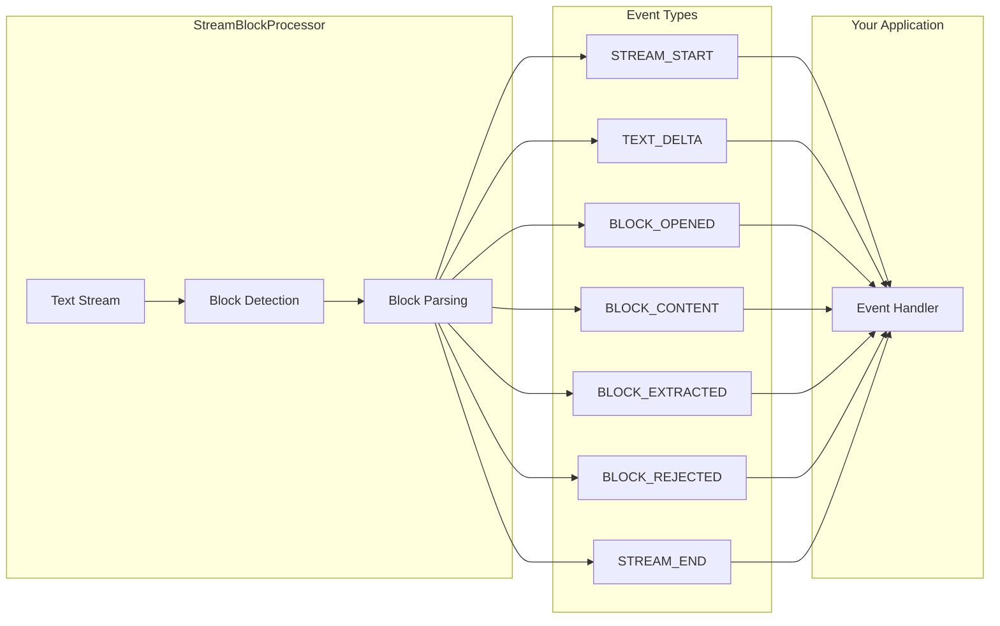
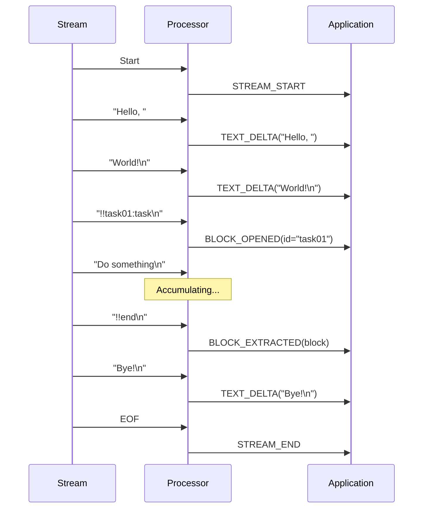

# Events

Streamblocks uses an event-driven architecture to notify your application about processing state. This guide covers the event system, event types, and handling patterns.

## Overview



## Event Types

### EventType Enum

```python
from streamblocks import EventType

class EventType(Enum):
    """Types of events emitted during processing."""

    # Lifecycle events
    STREAM_START = "stream_start"
    STREAM_END = "stream_end"

    # Text events
    TEXT_DELTA = "text_delta"

    # Block events
    BLOCK_OPENED = "block_opened"
    BLOCK_CONTENT = "block_content"
    BLOCK_EXTRACTED = "block_extracted"
    BLOCK_REJECTED = "block_rejected"

    # Original events (passthrough)
    ORIGINAL_EVENT = "original_event"
```

### Event Categories

| Category | Events | Description |
|----------|--------|-------------|
| Lifecycle | `STREAM_START`, `STREAM_END` | Stream boundaries |
| Text | `TEXT_DELTA` | Non-block text |
| Block | `BLOCK_OPENED`, `BLOCK_CONTENT`, `BLOCK_EXTRACTED`, `BLOCK_REJECTED` | Block processing |
| Original | `ORIGINAL_EVENT` | Passthrough events |

## StreamEvent

All events are instances of `StreamEvent`:

```python
from streamblocks import StreamEvent

@dataclass
class StreamEvent:
    """Event emitted during stream processing."""

    type: EventType
    timestamp: datetime

    # Optional fields (depend on event type)
    text: str | None = None
    block: Block | None = None
    block_id: str | None = None
    rejection: BlockRejection | None = None
    original_event: Any | None = None
```

## Lifecycle Events

### STREAM_START

Emitted when processing begins:

```python
async for event in processor.process_stream(stream):
    if event.type == EventType.STREAM_START:
        print("Processing started")
        start_time = event.timestamp
```

### STREAM_END

Emitted when processing completes:

```python
async for event in processor.process_stream(stream):
    if event.type == EventType.STREAM_END:
        print("Processing complete")
        end_time = event.timestamp
```

## Text Events

### TEXT_DELTA

Emitted for non-block text when `emit_text_deltas=True`:

```python
processor = StreamBlockProcessor(
    registry=registry,
    syntax=syntax,
    emit_text_deltas=True,
)

async for event in processor.process_stream(stream):
    if event.type == EventType.TEXT_DELTA:
        print(event.text, end="", flush=True)
```

**Event fields:**

- `text`: The text chunk received

## Block Events

### BLOCK_OPENED

Emitted when a block start is detected:

```python
async for event in processor.process_stream(stream):
    if event.type == EventType.BLOCK_OPENED:
        print(f"Block started: {event.block_id}")
        # Prepare UI for incoming block
```

**Event fields:**

- `block_id`: The block identifier from the header

### BLOCK_CONTENT

Emitted for each content line when `emit_block_content=True`:

```python
processor = StreamBlockProcessor(
    registry=registry,
    syntax=syntax,
    emit_block_content=True,
)

async for event in processor.process_stream(stream):
    if event.type == EventType.BLOCK_CONTENT:
        print(f"Content: {event.text}")
```

**Event fields:**

- `text`: The content line
- `block_id`: The current block ID

### BLOCK_EXTRACTED

Emitted when a block is successfully parsed and validated:

```python
async for event in processor.process_stream(stream):
    if event.type == EventType.BLOCK_EXTRACTED:
        block = event.block
        print(f"Block: {block.metadata.id} ({block.metadata.block_type})")
        print(f"Content: {block.content.raw_content}")
```

**Event fields:**

- `block`: The complete `Block` instance

### BLOCK_REJECTED

Emitted when a block fails validation:

```python
async for event in processor.process_stream(stream):
    if event.type == EventType.BLOCK_REJECTED:
        rejection = event.rejection
        print(f"Rejected: {rejection.reason.value}")
        print(f"Message: {rejection.message}")
```

**Event fields:**

- `rejection`: `BlockRejection` with error details

## Original Events

### ORIGINAL_EVENT

Emitted for passthrough events when `emit_original_events=True`:

```python
processor = StreamBlockProcessor(
    registry=registry,
    syntax=syntax,
    emit_original_events=True,
)

async for event in processor.process_stream(stream):
    if event.type == EventType.ORIGINAL_EVENT:
        # Handle provider-specific event
        handle_original(event.original_event)
```

## Event Handling Patterns

### Match Statement

```python
async for event in processor.process_stream(stream):
    match event.type:
        case EventType.STREAM_START:
            on_start()
        case EventType.TEXT_DELTA:
            on_text(event.text)
        case EventType.BLOCK_OPENED:
            on_block_open(event.block_id)
        case EventType.BLOCK_EXTRACTED:
            on_block(event.block)
        case EventType.BLOCK_REJECTED:
            on_rejected(event.rejection)
        case EventType.STREAM_END:
            on_end()
```

### Filtered Handling

```python
# Only handle block events
async for event in processor.process_stream(stream):
    if event.type == EventType.BLOCK_EXTRACTED:
        await process_block(event.block)
    elif event.type == EventType.BLOCK_REJECTED:
        await log_rejection(event.rejection)
```

### Callback-Based

```python
class EventHandler:
    def __init__(self):
        self.handlers = {
            EventType.STREAM_START: self.on_start,
            EventType.TEXT_DELTA: self.on_text,
            EventType.BLOCK_EXTRACTED: self.on_block,
            EventType.STREAM_END: self.on_end,
        }

    async def handle(self, event: StreamEvent):
        handler = self.handlers.get(event.type)
        if handler:
            await handler(event)

    async def on_start(self, event):
        print("Started")

    async def on_text(self, event):
        print(event.text, end="")

    async def on_block(self, event):
        print(f"\nBlock: {event.block.metadata.id}")

    async def on_end(self, event):
        print("\nDone")

handler = EventHandler()
async for event in processor.process_stream(stream):
    await handler.handle(event)
```

## Event Timeline



## Configuration

### Controlling Event Emission

```python
# Minimal events
processor = StreamBlockProcessor(
    registry=registry,
    syntax=syntax,
    emit_text_deltas=False,     # No TEXT_DELTA
    emit_block_content=False,    # No BLOCK_CONTENT
    emit_original_events=False,  # No ORIGINAL_EVENT
)
# Only emits: STREAM_START, BLOCK_OPENED, BLOCK_EXTRACTED, BLOCK_REJECTED, STREAM_END

# Full events
processor = StreamBlockProcessor(
    registry=registry,
    syntax=syntax,
    emit_text_deltas=True,       # TEXT_DELTA for non-block text
    emit_block_content=True,     # BLOCK_CONTENT during accumulation
    emit_original_events=True,   # ORIGINAL_EVENT for passthrough
)
```

## Statistics Tracking

```python
from dataclasses import dataclass, field
from collections import Counter

@dataclass
class ProcessingStats:
    text_chunks: int = 0
    text_chars: int = 0
    blocks_opened: int = 0
    blocks_extracted: int = 0
    blocks_rejected: int = 0
    block_types: Counter = field(default_factory=Counter)

stats = ProcessingStats()

async for event in processor.process_stream(stream):
    match event.type:
        case EventType.TEXT_DELTA:
            stats.text_chunks += 1
            stats.text_chars += len(event.text)
        case EventType.BLOCK_OPENED:
            stats.blocks_opened += 1
        case EventType.BLOCK_EXTRACTED:
            stats.blocks_extracted += 1
            stats.block_types[event.block.metadata.block_type] += 1
        case EventType.BLOCK_REJECTED:
            stats.blocks_rejected += 1

print(f"Text: {stats.text_chunks} chunks, {stats.text_chars} chars")
print(f"Blocks: {stats.blocks_extracted} extracted, {stats.blocks_rejected} rejected")
print(f"Types: {dict(stats.block_types)}")
```

## Error Handling

```python
async def process_with_errors(stream):
    try:
        async for event in processor.process_stream(stream):
            try:
                await handle_event(event)
            except EventHandlingError as e:
                logger.error(f"Error handling {event.type}: {e}")
                # Continue processing
    except StreamError as e:
        logger.error(f"Stream error: {e}")
        raise
```

## Next Steps

- [Error Handling](errors.md) - Error patterns
- [Patterns](patterns.md) - Common patterns
- [API Reference](reference/events.md) - Event API details
