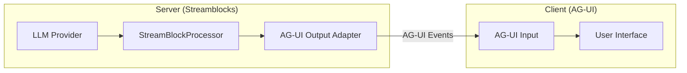

# AG-UI Protocol Integration

Streamblocks integrates with the [AG-UI protocol](https://docs.ag-ui.com) for streaming structured events to rich client interfaces.

## Overview

The AG-UI protocol defines a standard format for streaming AI agent events to user interfaces. Streamblocks provides bidirectional adapters for working with AG-UI.



## Installation

```bash
pip install streamblocks[agui]
```

## Basic Usage

### Output Adapter

Convert Streamblocks events to AG-UI protocol:

```python
from streamblocks import StreamBlockProcessor, BlockRegistry, Syntax, EventType
from streamblocks.ext.agui import AGUIOutputAdapter

# Create processor with AG-UI output
processor = StreamBlockProcessor(
    registry=BlockRegistry(),
    syntax=Syntax.DELIMITER_PREAMBLE,
    output_adapter=AGUIOutputAdapter(),
)

async def stream_agui_events(llm_stream):
    async for event in processor.process_stream(llm_stream):
        # Events are now AG-UI formatted
        yield event
```

### Input Adapter

Process incoming AG-UI events:

```python
from streamblocks.ext.agui import AGUIInputAdapter

processor = StreamBlockProcessor(
    registry=BlockRegistry(),
    syntax=Syntax.DELIMITER_PREAMBLE,
    input_adapter=AGUIInputAdapter(),
)

async def process_agui_stream(agui_stream):
    async for event in processor.process_stream(agui_stream):
        if event.type == EventType.BLOCK_EXTRACTED:
            handle_block(event.block)
```

### Bidirectional

Use both adapters for full AG-UI support:

```python
from streamblocks.ext.agui import AGUIInputAdapter, AGUIOutputAdapter

processor = StreamBlockProcessor(
    registry=BlockRegistry(),
    syntax=Syntax.DELIMITER_PREAMBLE,
    input_adapter=AGUIInputAdapter(),
    output_adapter=AGUIOutputAdapter(),
)
```

## Event Mapping

### Streamblocks to AG-UI

| Streamblocks Event | AG-UI Event |
|-------------------|-------------|
| `STREAM_START` | `RunStarted` |
| `TEXT_DELTA` | `TextMessageContent` |
| `BLOCK_OPENED` | `ToolCallStart` / Custom |
| `BLOCK_EXTRACTED` | `ToolCallEnd` / Custom |
| `STREAM_END` | `RunFinished` |

### AG-UI to Streamblocks

| AG-UI Event | Streamblocks Category |
|-------------|----------------------|
| `TextMessageContent` | `TEXT_CONTENT` |
| `ToolCallStart` | `PASSTHROUGH` |
| `ToolCallEnd` | `PASSTHROUGH` |
| `RunStarted` | `STREAM_START` |
| `RunFinished` | `STREAM_END` |

## Configuration

### Event Filtering

Control which events are converted:

```python
output_adapter = AGUIOutputAdapter(
    include_text_deltas=True,
    include_block_content=False,
    include_metadata=True,
)
```

### Custom Event Types

Map custom block types to AG-UI events:

```python
output_adapter = AGUIOutputAdapter(
    block_type_mapping={
        "task": "CustomTaskEvent",
        "code": "CodeBlockEvent",
        "message": "TextMessageContent",
    }
)
```

## FastAPI Integration

### SSE Endpoint

```python
from fastapi import FastAPI
from fastapi.responses import StreamingResponse
from streamblocks import StreamBlockProcessor, BlockRegistry, Syntax
from streamblocks.ext.agui import AGUIOutputAdapter
import json

app = FastAPI()

@app.post("/agent/stream")
async def stream_agent(request: AgentRequest):
    async def generate():
        processor = StreamBlockProcessor(
            registry=BlockRegistry(),
            syntax=Syntax.DELIMITER_PREAMBLE,
            output_adapter=AGUIOutputAdapter(),
        )

        llm_stream = get_llm_stream(request.prompt)

        async for event in processor.process_stream(llm_stream):
            yield f"data: {json.dumps(event)}\n\n"

        yield "data: [DONE]\n\n"

    return StreamingResponse(
        generate(),
        media_type="text/event-stream",
    )
```

### WebSocket Endpoint

```python
from fastapi import WebSocket

@app.websocket("/agent/ws")
async def websocket_agent(websocket: WebSocket):
    await websocket.accept()

    processor = StreamBlockProcessor(
        registry=BlockRegistry(),
        syntax=Syntax.DELIMITER_PREAMBLE,
        output_adapter=AGUIOutputAdapter(),
    )

    # Receive prompt
    data = await websocket.receive_json()
    prompt = data["prompt"]

    # Stream response
    llm_stream = get_llm_stream(prompt)

    async for event in processor.process_stream(llm_stream):
        await websocket.send_json(event)

    await websocket.close()
```

## Client Integration

### JavaScript Client

```javascript
const eventSource = new EventSource('/agent/stream');

eventSource.onmessage = (event) => {
    if (event.data === '[DONE]') {
        eventSource.close();
        return;
    }

    const data = JSON.parse(event.data);

    switch (data.type) {
        case 'TextMessageContent':
            appendText(data.content);
            break;
        case 'ToolCallStart':
            showToolCallStart(data.name);
            break;
        case 'ToolCallEnd':
            showToolCallResult(data.result);
            break;
    }
};
```

### React Integration

```jsx
import { useAGUI } from '@ag-ui/react';

function AgentChat() {
    const { events, sendMessage, isStreaming } = useAGUI({
        url: '/agent/stream',
    });

    return (
        <div>
            {events.map((event, i) => (
                <EventRenderer key={i} event={event} />
            ))}
            <input
                onSubmit={(e) => sendMessage(e.target.value)}
                disabled={isStreaming}
            />
        </div>
    );
}
```

## Custom Block to AG-UI

Map custom block types to AG-UI events:

```python
class CustomAGUIOutputAdapter(AGUIOutputAdapter):
    def to_protocol_event(self, event):
        if event.type == EventType.BLOCK_EXTRACTED:
            block = event.block

            if block.metadata.block_type == "task":
                return {
                    "type": "TaskCreated",
                    "id": block.metadata.id,
                    "title": block.content.raw_content[:50],
                    "priority": getattr(block.metadata, "priority", "normal"),
                }

            if block.metadata.block_type == "code":
                return {
                    "type": "CodeBlock",
                    "language": getattr(block.metadata, "language", "text"),
                    "code": block.content.raw_content,
                }

        # Default handling
        return super().to_protocol_event(event)
```

## Error Handling

### Protocol Errors

```python
from streamblocks.ext.agui import AGUIProtocolError

try:
    async for event in processor.process_stream(agui_stream):
        handle_event(event)
except AGUIProtocolError as e:
    logger.error(f"Protocol error: {e}")
    # Send error event to client
    yield {"type": "Error", "message": str(e)}
```

### Graceful Degradation

```python
output_adapter = AGUIOutputAdapter(
    on_error="skip",  # Skip invalid events
    # on_error="raise",  # Raise exception (default)
    # on_error="fallback",  # Use fallback format
)
```

## Best Practices

!!! tip "Use Proper Event Types"
    Map block types to appropriate AG-UI event types for best client experience.

!!! tip "Include Metadata"
    Send relevant metadata with events for rich client rendering.

!!! tip "Handle Errors Gracefully"
    Always send error events to clients instead of just closing connections.

!!! tip "Test with AG-UI Inspector"
    Use the AG-UI inspector tool to debug event streams.

## Next Steps

- [PydanticAI Integration](pydantic_ai.md) - AI agent integration
- [Adapters](../adapters.md) - Adapter details
- [Architecture: Adapters](../architecture/adapters.md) - Adapter internals
