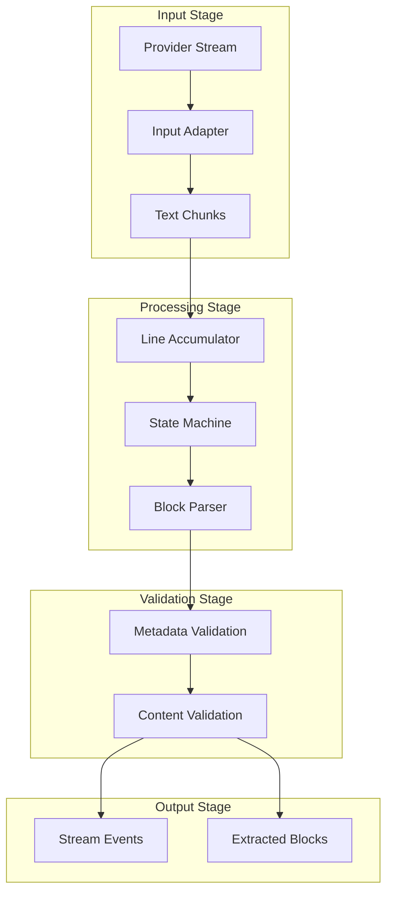
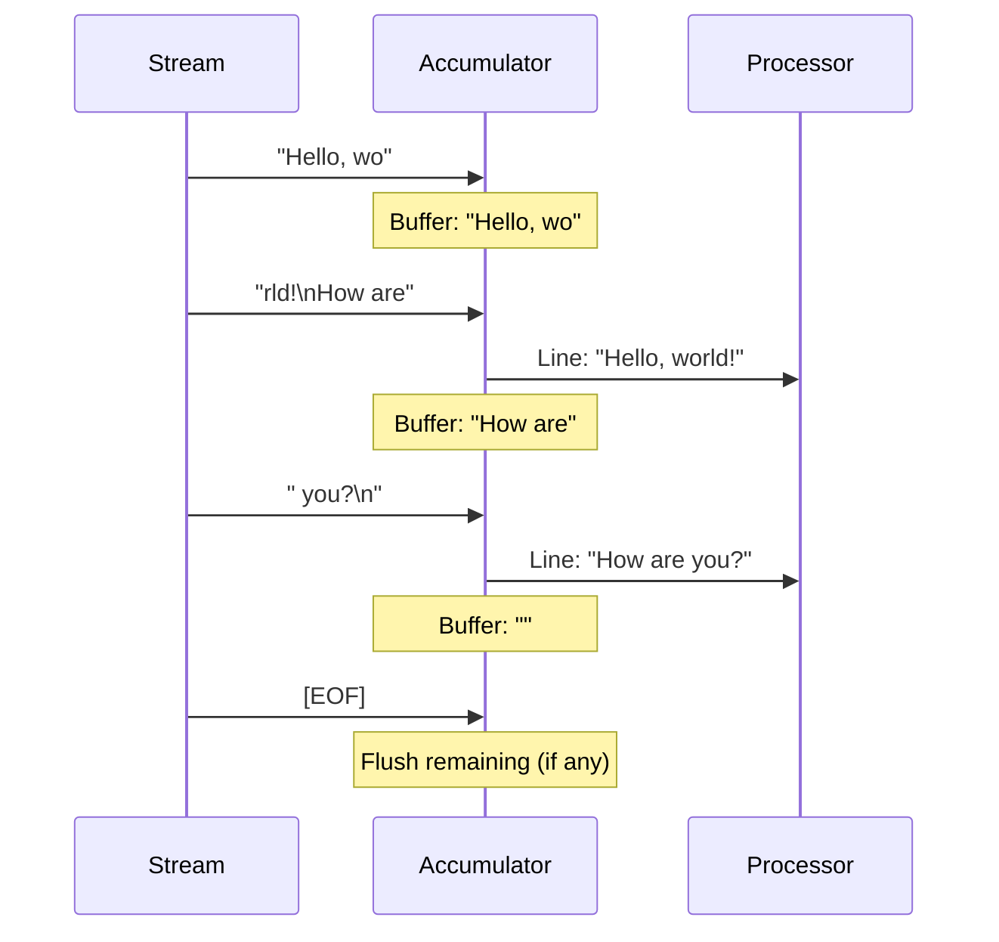
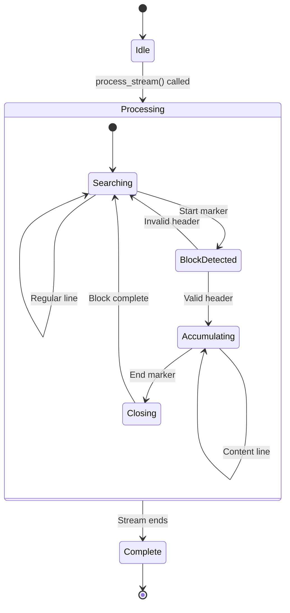

# Stream Processing

This guide covers the stream processing system in depth, including line accumulation, chunk handling, and processing configuration.

## Overview



## Line Accumulation

Text arrives as chunks that may not align with line boundaries. The line accumulator handles this:

### Chunk Splitting

```python
# Example: chunks don't align with lines
chunk1 = "Hello, wo"      # Partial line
chunk2 = "rld!\nHow are"  # End of line + partial
chunk3 = " you?\n"        # End of second line

# Accumulator produces complete lines:
# Line 1: "Hello, world!"
# Line 2: "How are you?"
```

### Accumulation Process



### Implementation

```python
class LineAccumulator:
    """Accumulates text chunks into complete lines."""

    def __init__(self):
        self.buffer = ""

    def add_chunk(self, chunk: str) -> list[str]:
        """Add a chunk and return any complete lines."""
        self.buffer += chunk
        lines = []

        while "\n" in self.buffer:
            line, self.buffer = self.buffer.split("\n", 1)
            lines.append(line)

        return lines

    def flush(self) -> str | None:
        """Flush remaining buffer at stream end."""
        if self.buffer:
            remaining = self.buffer
            self.buffer = ""
            return remaining
        return None
```

## Processing Configuration

### Basic Configuration

```python
processor = StreamBlockProcessor(
    registry=registry,
    syntax=Syntax.DELIMITER_PREAMBLE,
)
```

### Event Emission Options

Control which events are emitted:

```python
processor = StreamBlockProcessor(
    registry=registry,
    syntax=syntax,

    # TEXT_DELTA events for non-block text
    emit_text_deltas=True,

    # BLOCK_CONTENT events during accumulation
    emit_block_content=True,

    # Original provider events (passthrough)
    emit_original_events=False,
)
```

| Option | Default | Description |
|--------|---------|-------------|
| `emit_text_deltas` | `True` | Emit TEXT_DELTA for regular text |
| `emit_block_content` | `False` | Emit BLOCK_CONTENT during accumulation |
| `emit_original_events` | `False` | Pass through original provider events |

### Size Limits

Prevent memory issues with large blocks:

```python
processor = StreamBlockProcessor(
    registry=registry,
    syntax=syntax,
    max_block_size=100_000,  # Characters
)
```

When exceeded:
- Block is rejected with `MAX_SIZE_EXCEEDED`
- BLOCK_REJECTED event is emitted
- Processing continues with next content

### Adapter Configuration

```python
# Auto-detect adapter
processor = StreamBlockProcessor(
    registry=registry,
    syntax=syntax,
    input_adapter="auto",
)

# Explicit adapter
from streamblocks.ext.gemini import GeminiInputAdapter

processor = StreamBlockProcessor(
    registry=registry,
    syntax=syntax,
    input_adapter=GeminiInputAdapter(),
)

# Output adapter
from streamblocks.ext.agui import AGUIOutputAdapter

processor = StreamBlockProcessor(
    registry=registry,
    syntax=syntax,
    output_adapter=AGUIOutputAdapter(),
)
```

## Processing Lifecycle

### Stream Lifecycle



### Event Flow

```python
async for event in processor.process_stream(stream):
    # Events in order:
    # 1. STREAM_START (once)
    # 2. TEXT_DELTA (0+ times, for non-block text)
    # 3. BLOCK_OPENED (when block starts)
    # 4. BLOCK_CONTENT (0+ times, if emit_block_content=True)
    # 5. BLOCK_EXTRACTED or BLOCK_REJECTED (when block ends)
    # 6. More TEXT_DELTA, BLOCK_* as needed
    # 7. STREAM_END (once)
    pass
```

## Processing Modes

### Batch Processing

Collect all blocks after stream completes:

```python
async def batch_process(stream):
    blocks = []

    async for event in processor.process_stream(stream):
        if event.type == EventType.BLOCK_EXTRACTED:
            blocks.append(event.block)

    return blocks
```

### Real-time Processing

Handle events as they arrive:

```python
async def realtime_process(stream):
    async for event in processor.process_stream(stream):
        match event.type:
            case EventType.TEXT_DELTA:
                await display_text(event.text)
            case EventType.BLOCK_OPENED:
                await show_block_placeholder(event.block_id)
            case EventType.BLOCK_EXTRACTED:
                await render_block(event.block)
```

### Filtered Processing

Only process specific event types:

```python
async def filtered_process(stream):
    async for event in processor.process_stream(stream):
        # Only handle block events
        if event.type in (EventType.BLOCK_EXTRACTED, EventType.BLOCK_REJECTED):
            await handle_block_event(event)
```

## Error Handling

### Stream Errors

```python
async def process_with_error_handling(stream):
    try:
        async for event in processor.process_stream(stream):
            await handle_event(event)
    except StreamError as e:
        logger.error(f"Stream error: {e}")
        await handle_stream_error(e)
    except Exception as e:
        logger.error(f"Unexpected error: {e}")
        raise
```

### Block Rejections

```python
async for event in processor.process_stream(stream):
    if event.type == EventType.BLOCK_REJECTED:
        rejection = event.rejection

        match rejection.reason:
            case BlockErrorCode.INVALID_METADATA:
                logger.warning(f"Invalid metadata: {rejection.message}")
            case BlockErrorCode.MAX_SIZE_EXCEEDED:
                logger.warning(f"Block too large")
            case BlockErrorCode.VALIDATION_FAILED:
                logger.warning(f"Validation failed: {rejection.message}")
```

### Graceful Degradation

Continue processing after errors:

```python
async def resilient_process(stream):
    extracted = 0
    rejected = 0

    async for event in processor.process_stream(stream):
        if event.type == EventType.BLOCK_EXTRACTED:
            extracted += 1
            try:
                await process_block(event.block)
            except ProcessingError:
                rejected += 1  # Count as rejected but continue

        elif event.type == EventType.BLOCK_REJECTED:
            rejected += 1
            # Log but continue

    return extracted, rejected
```

## Performance Considerations

### Memory Efficiency

```python
# Process large streams without memory issues
processor = StreamBlockProcessor(
    registry=registry,
    syntax=syntax,
    max_block_size=50_000,       # Limit individual blocks
    emit_block_content=False,    # Don't emit content events
)

# Process events immediately, don't accumulate
async for event in processor.process_stream(stream):
    if event.type == EventType.BLOCK_EXTRACTED:
        await process_and_forget(event.block)  # Don't store
```

### Throughput Optimization

```python
# Minimal event emission for speed
processor = StreamBlockProcessor(
    registry=registry,
    syntax=syntax,
    emit_text_deltas=False,      # Skip text events
    emit_block_content=False,    # Skip content events
    emit_original_events=False,  # Skip original events
)
```

### Concurrent Processing

```python
import asyncio

async def process_multiple_streams(streams):
    async def process_one(stream):
        processor = StreamBlockProcessor(
            registry=BlockRegistry(),
            syntax=syntax,
        )

        blocks = []
        async for event in processor.process_stream(stream):
            if event.type == EventType.BLOCK_EXTRACTED:
                blocks.append(event.block)
        return blocks

    # Process streams concurrently
    results = await asyncio.gather(*[process_one(s) for s in streams])
    return results
```

## Debugging

### Enable Logging

```python
import logging

# Enable debug logging
logging.basicConfig(level=logging.DEBUG)
logging.getLogger("streamblocks").setLevel(logging.DEBUG)

# Or use structlog
import structlog

logger = structlog.get_logger("my_app")
processor = StreamBlockProcessor(
    registry=registry,
    syntax=syntax,
    logger=logger,
)
```

### Trace Events

```python
async def trace_process(stream):
    async for event in processor.process_stream(stream):
        print(f"Event: {event.type.name}")
        if hasattr(event, "text"):
            print(f"  Text: {event.text[:50]}...")
        if hasattr(event, "block"):
            print(f"  Block: {event.block.metadata.id}")
        if hasattr(event, "rejection"):
            print(f"  Rejection: {event.rejection.reason}")
```

## Next Steps

- [Syntaxes](syntaxes.md) - Block format syntaxes
- [Adapters](adapters.md) - Input/output adapters
- [Events](events.md) - Event system details
- [Performance](performance.md) - Optimization tips
