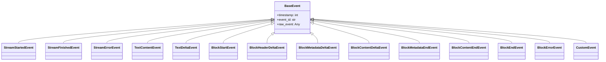

# Event Types Reference

Complete reference for all Streamblocks event types.

## Event Hierarchy



## EventType Enumeration

All event types as string enumeration:

```python
from hother.streamblocks import EventType

# Lifecycle events
EventType.STREAM_STARTED    # Stream processing began
EventType.STREAM_FINISHED   # Stream processing completed
EventType.STREAM_ERROR      # Stream processing failed

# Text events
EventType.TEXT_CONTENT      # Complete line outside blocks
EventType.TEXT_DELTA        # Real-time text chunk

# Block lifecycle events
EventType.BLOCK_START          # Block opening detected
EventType.BLOCK_HEADER_DELTA   # Header content delta
EventType.BLOCK_METADATA_DELTA # Metadata section delta
EventType.BLOCK_CONTENT_DELTA  # Content section delta
EventType.BLOCK_METADATA_END   # Metadata section completed
EventType.BLOCK_CONTENT_END    # Content section completed
EventType.BLOCK_END            # Block successfully extracted
EventType.BLOCK_ERROR          # Block extraction failed

# Custom events
EventType.CUSTOM            # Application-specific event
```

## Lifecycle Events

### StreamStartedEvent

Emitted when stream processing begins.

```python
from hother.streamblocks import StreamStartedEvent

# Fields
event.type          # EventType.STREAM_STARTED
event.stream_id     # Unique stream identifier
event.registry_name # Registry name (optional)
event.timestamp     # Unix timestamp in milliseconds
event.event_id      # Unique event identifier
```

### StreamFinishedEvent

Emitted when stream processing completes successfully.

```python
from hother.streamblocks import StreamFinishedEvent

# Fields
event.type              # EventType.STREAM_FINISHED
event.stream_id         # Unique stream identifier
event.blocks_extracted  # Number of successfully extracted blocks
event.blocks_rejected   # Number of rejected blocks
event.total_events      # Total events emitted
event.duration_ms       # Processing duration in milliseconds
```

### StreamErrorEvent

Emitted when stream processing fails.

```python
from hother.streamblocks import StreamErrorEvent

# Fields
event.type       # EventType.STREAM_ERROR
event.stream_id  # Unique stream identifier
event.error      # Error message
event.error_code # Error code (optional)
```

## Text Events

### TextContentEvent

Complete line of text outside any block.

```python
from hother.streamblocks import TextContentEvent

# Fields
event.type        # EventType.TEXT_CONTENT
event.content     # Complete line content
event.line_number # Line number in stream
```

### TextDeltaEvent

Real-time text chunk (character/token level).

```python
from hother.streamblocks import TextDeltaEvent

# Fields
event.type        # EventType.TEXT_DELTA
event.delta       # Text chunk
event.inside_block # Whether inside a block
event.block_id    # Block ID if inside block
event.section     # "header", "metadata", or "content"
```

## Block Events

### BlockStartEvent

Block opening detected - begins block lifecycle.

```python
from hother.streamblocks import BlockStartEvent

# Fields
event.type            # EventType.BLOCK_START
event.block_id        # Unique block identifier
event.block_type      # Block type (may be None until parsed)
event.syntax          # Syntax name
event.start_line      # Starting line number
event.inline_metadata # Parsed inline metadata (optional)
```

### BlockHeaderDeltaEvent

Delta event for block header section.

```python
from hother.streamblocks import BlockHeaderDeltaEvent

# Fields
event.type             # EventType.BLOCK_HEADER_DELTA
event.block_id         # Block identifier
event.delta            # Header content chunk
event.syntax           # Syntax name
event.current_line     # Current line number
event.accumulated_size # Total accumulated bytes
event.inline_metadata  # Parsed inline metadata (optional)
```

### BlockMetadataDeltaEvent

Delta event for block metadata section.

```python
from hother.streamblocks import BlockMetadataDeltaEvent

# Fields
event.type             # EventType.BLOCK_METADATA_DELTA
event.block_id         # Block identifier
event.delta            # Metadata content chunk
event.syntax           # Syntax name
event.current_line     # Current line number
event.accumulated_size # Total accumulated bytes
event.is_boundary      # Whether contains section boundary
```

### BlockContentDeltaEvent

Delta event for block content section.

```python
from hother.streamblocks import BlockContentDeltaEvent

# Fields
event.type             # EventType.BLOCK_CONTENT_DELTA
event.block_id         # Block identifier
event.delta            # Content chunk
event.syntax           # Syntax name
event.current_line     # Current line number
event.accumulated_size # Total accumulated bytes
```

### BlockMetadataEndEvent

Emitted when metadata section completes.

```python
from hother.streamblocks import BlockMetadataEndEvent

# Fields
event.type             # EventType.BLOCK_METADATA_END
event.block_id         # Block identifier
event.syntax           # Syntax name
event.start_line       # Metadata start line
event.end_line         # Metadata end line
event.raw_metadata     # Raw metadata string
event.parsed_metadata  # Parsed metadata dict (optional)
event.validation_passed # Whether validation passed
event.validation_error # Validation error message (optional)
```

### BlockContentEndEvent

Emitted when content section completes.

```python
from hother.streamblocks import BlockContentEndEvent

# Fields
event.type             # EventType.BLOCK_CONTENT_END
event.block_id         # Block identifier
event.syntax           # Syntax name
event.start_line       # Content start line
event.end_line         # Content end line
event.raw_content      # Raw content string
event.parsed_content   # Parsed content dict (optional)
event.validation_passed # Whether validation passed
event.validation_error # Validation error message (optional)
```

### BlockEndEvent

Block successfully extracted and validated.

```python
from hother.streamblocks import BlockEndEvent

# Fields
event.type        # EventType.BLOCK_END
event.block_id    # Block identifier
event.block_type  # Block type string
event.syntax      # Syntax name
event.start_line  # Block start line
event.end_line    # Block end line
event.metadata    # Metadata as dict
event.content     # Content as dict
event.raw_content # Raw content string
event.hash_id     # Content hash for deduplication

# Methods
event.get_block() # Get typed ExtractedBlock
```

### BlockErrorEvent

Block extraction failed.

```python
from hother.streamblocks import BlockErrorEvent, BlockErrorCode

# Fields
event.type       # EventType.BLOCK_ERROR
event.block_id   # Block identifier (optional)
event.reason     # Error reason message
event.error_code # BlockErrorCode enum value
event.syntax     # Syntax name
event.start_line # Block start line
event.end_line   # Block end line (optional)
event.exception  # Exception object (excluded from serialization)
```

## BlockErrorCode Enumeration

Standard error codes for `BlockErrorEvent`:

```python
from hother.streamblocks import BlockErrorCode

BlockErrorCode.VALIDATION_FAILED  # Pydantic validation failed
BlockErrorCode.SIZE_EXCEEDED      # Block exceeded size limit
BlockErrorCode.UNCLOSED_BLOCK     # Missing closing marker
BlockErrorCode.UNKNOWN_TYPE       # Unregistered block type
BlockErrorCode.PARSE_FAILED       # Content parsing failed
BlockErrorCode.MISSING_METADATA   # Required metadata missing
BlockErrorCode.MISSING_CONTENT    # Required content missing
BlockErrorCode.SYNTAX_ERROR       # Syntax detection error
```

## Custom Events

### CustomEvent

Application-specific custom events.

```python
from hother.streamblocks import CustomEvent

# Fields
event.type   # EventType.CUSTOM
event.name   # Custom event name
event.value  # Custom event data dict
```

## Event Union Type

The `Event` type is a discriminated union of all event types:

```python
from hother.streamblocks import Event

def handle_event(event: Event) -> None:
    match event.type:
        case EventType.BLOCK_END:
            print(f"Block extracted: {event.block_type}")
        case EventType.BLOCK_ERROR:
            print(f"Block failed: {event.reason}")
        case EventType.TEXT_DELTA:
            print(event.delta, end="")
```

## API Reference

::: hother.streamblocks.core.types.EventType
    options:
      show_root_heading: true
      show_source: false

::: hother.streamblocks.core.types.BlockState
    options:
      show_root_heading: true
      show_source: false

::: hother.streamblocks.core.types.BlockErrorCode
    options:
      show_root_heading: true
      show_source: false

::: hother.streamblocks.core.types.BaseEvent
    options:
      show_root_heading: true
      show_source: false

::: hother.streamblocks.core.types.StreamStartedEvent
    options:
      show_root_heading: true
      show_source: false

::: hother.streamblocks.core.types.StreamFinishedEvent
    options:
      show_root_heading: true
      show_source: false

::: hother.streamblocks.core.types.BlockStartEvent
    options:
      show_root_heading: true
      show_source: false

::: hother.streamblocks.core.types.BlockEndEvent
    options:
      show_root_heading: true
      show_source: false

::: hother.streamblocks.core.types.BlockErrorEvent
    options:
      show_root_heading: true
      show_source: false

::: hother.streamblocks.core.types.TextDeltaEvent
    options:
      show_root_heading: true
      show_source: false
