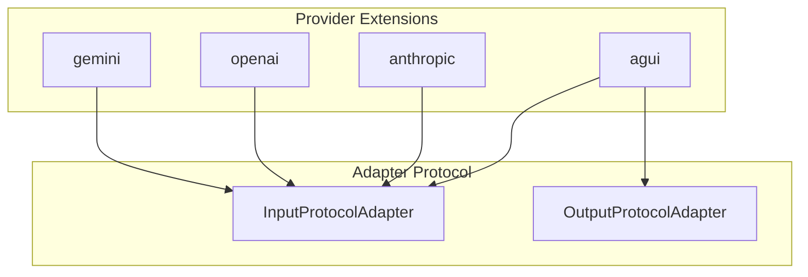

# Extensions Reference

Provider-specific extensions for Streamblocks.

## Overview

Extensions provide adapters for different LLM providers. Each extension implements the adapter protocol to convert provider-specific stream formats.



## Installation

Extensions are installed as optional dependencies:

=== "uv"
    ```bash
    # Individual providers
    uv add "streamblocks[gemini]"
    uv add "streamblocks[openai]"
    uv add "streamblocks[anthropic]"

    # All providers
    uv add "streamblocks[all-providers]"
    ```

=== "pip"
    ```bash
    # Individual providers
    pip install "streamblocks[gemini]"
    pip install "streamblocks[openai]"
    pip install "streamblocks[anthropic]"

    # All providers
    pip install "streamblocks[all-providers]"
    ```

## Gemini Extension

Google Gemini adapter for processing Gemini API responses.

### Installation

```bash
uv add "streamblocks[gemini]"
```

### Usage

```python
from hother.streamblocks.extensions.gemini import GeminiInputAdapter

adapter = GeminiInputAdapter()

# Use with processor
processor = StreamBlockProcessor(
    registry=Registry(),
    syntaxes=[DelimiterPreambleSyntax()],
    input_adapter=adapter,
)
```

### Auto-Detection

The Gemini adapter is automatically detected when processing Gemini responses:

```python
import google.generativeai as genai
from hother.streamblocks import StreamBlockProcessor, detect_input_adapter

genai.configure(api_key="...")  # pragma: allowlist secret
model = genai.GenerativeModel("gemini-pro")
response = model.generate_content("...", stream=True)

# Auto-detect adapter
adapter = detect_input_adapter(response)
```

## OpenAI Extension

OpenAI adapter for processing OpenAI API responses.

### Installation

```bash
uv add "streamblocks[openai]"
```

### Usage

```python
from hother.streamblocks.extensions.openai import OpenAIInputAdapter

adapter = OpenAIInputAdapter()

# Use with processor
processor = StreamBlockProcessor(
    registry=Registry(),
    syntaxes=[DelimiterPreambleSyntax()],
    input_adapter=adapter,
)
```

### With OpenAI Client

```python
from openai import OpenAI
from hother.streamblocks import StreamBlockProcessor, Registry, DelimiterPreambleSyntax
from hother.streamblocks.extensions.openai import OpenAIInputAdapter

client = OpenAI()
stream = client.chat.completions.create(
    model="gpt-4",
    messages=[{"role": "user", "content": "..."}],
    stream=True,
)

processor = StreamBlockProcessor(
    registry=Registry(),
    syntaxes=[DelimiterPreambleSyntax()],
    input_adapter=OpenAIInputAdapter(),
)

async for event in processor.process_stream(stream):
    handle_event(event)
```

## Anthropic Extension

Anthropic adapter for processing Claude API responses.

### Installation

```bash
uv add "streamblocks[anthropic]"
```

### Usage

```python
from hother.streamblocks.extensions.anthropic import AnthropicInputAdapter

adapter = AnthropicInputAdapter()

# Use with processor
processor = StreamBlockProcessor(
    registry=Registry(),
    syntaxes=[DelimiterPreambleSyntax()],
    input_adapter=adapter,
)
```

### With Anthropic Client

```python
import anthropic
from hother.streamblocks import StreamBlockProcessor, Registry, DelimiterPreambleSyntax
from hother.streamblocks.extensions.anthropic import AnthropicInputAdapter

client = anthropic.Anthropic()

processor = StreamBlockProcessor(
    registry=Registry(),
    syntaxes=[DelimiterPreambleSyntax()],
    input_adapter=AnthropicInputAdapter(),
)

with client.messages.stream(
    model="claude-3-opus",
    max_tokens=1024,
    messages=[{"role": "user", "content": "..."}],
) as stream:
    async for event in processor.process_stream(stream):
        handle_event(event)
```

## AG-UI Extension

AG-UI protocol adapters for bidirectional streaming.

### Installation

The AG-UI extension is included in the base installation.

### Input Adapter

Process incoming AG-UI events:

```python
from hother.streamblocks.extensions.agui import AGUIInputAdapter

adapter = AGUIInputAdapter()

processor = StreamBlockProcessor(
    registry=Registry(),
    syntaxes=[DelimiterPreambleSyntax()],
    input_adapter=adapter,
)

async for event in processor.process_stream(agui_stream):
    handle_event(event)
```

### Output Adapter

Convert Streamblocks events to AG-UI protocol:

```python
from hother.streamblocks.extensions.agui import AGUIOutputAdapter

adapter = AGUIOutputAdapter()

processor = StreamBlockProcessor(
    registry=Registry(),
    syntaxes=[DelimiterPreambleSyntax()],
    output_adapter=adapter,
)

# Events are now AG-UI formatted
async for event in processor.process_stream(llm_stream):
    yield event  # AG-UI protocol event
```

### Bidirectional Usage

```python
from hother.streamblocks.extensions.agui import AGUIInputAdapter, AGUIOutputAdapter

processor = StreamBlockProcessor(
    registry=Registry(),
    syntaxes=[DelimiterPreambleSyntax()],
    input_adapter=AGUIInputAdapter(),
    output_adapter=AGUIOutputAdapter(),
)
```

### Event Filtering

Configure which events are converted:

```python
from hother.streamblocks.extensions.agui import AGUIOutputAdapter

adapter = AGUIOutputAdapter(
    include_text_deltas=True,
    include_block_content=False,
    include_metadata=True,
)
```

### Custom Event Mapping

Map block types to AG-UI events:

```python
adapter = AGUIOutputAdapter(
    block_type_mapping={
        "task": "CustomTaskEvent",
        "code": "CodeBlockEvent",
        "message": "TextMessageContent",
    }
)
```

## Creating Custom Extensions

Implement the adapter protocol for custom providers:

```python
from hother.streamblocks import InputProtocolAdapter, EventCategory

class MyProviderAdapter(InputProtocolAdapter):
    """Adapter for MyProvider streams."""

    def categorize(self, event) -> EventCategory:
        """Categorize the event type."""
        if hasattr(event, "text"):
            return EventCategory.TEXT_CONTENT
        if hasattr(event, "tool_call"):
            return EventCategory.PASSTHROUGH
        return EventCategory.SKIP

    def extract_text(self, event) -> str:
        """Extract text content from event."""
        return event.text

    def get_original_event(self, event):
        """Get the original event for passthrough."""
        return event
```

## Extension API Reference

### Gemini

::: hother.streamblocks.extensions.gemini
    options:
      show_root_heading: true
      show_source: false
      members_order: source

### OpenAI

::: hother.streamblocks.extensions.openai
    options:
      show_root_heading: true
      show_source: false
      members_order: source

### Anthropic

::: hother.streamblocks.extensions.anthropic
    options:
      show_root_heading: true
      show_source: false
      members_order: source

### AG-UI

::: hother.streamblocks.extensions.agui
    options:
      show_root_heading: true
      show_source: false
      members_order: source

::: hother.streamblocks.extensions.agui.input_adapter
    options:
      show_root_heading: true
      show_source: false

::: hother.streamblocks.extensions.agui.output_adapter
    options:
      show_root_heading: true
      show_source: false

::: hother.streamblocks.extensions.agui.filters
    options:
      show_root_heading: true
      show_source: false
