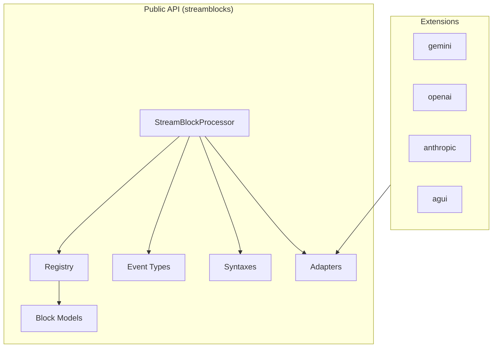

# API Reference

Complete API documentation for Streamblocks.

## Module Overview



## Core Modules

### [Core Components](core.md)

The main processing engine and core types:

| Class | Description |
|-------|-------------|
| `StreamBlockProcessor` | Main processing engine for extracting blocks |
| `Registry` | Block type registry with validation |
| `StreamState` | Processing state enumeration |
| `ValidationResult` | Validation outcome with errors |

### [Event Types](events.md)

All events emitted during stream processing:

| Event | Description |
|-------|-------------|
| `StreamStartedEvent` | Stream processing began |
| `StreamFinishedEvent` | Stream processing completed |
| `BlockStartEvent` | Block opening detected |
| `BlockEndEvent` | Block successfully extracted |
| `BlockErrorEvent` | Block extraction failed |
| `TextDeltaEvent` | Real-time text chunk |

### [Block Models](blocks.md)

Block structure and models:

| Class | Description |
|-------|-------------|
| `Block` | Generic block type definition |
| `ExtractedBlock` | Extracted block with typed content |
| `BlockCandidate` | Block during parsing |
| `BaseMetadata` | Base metadata model |
| `BaseContent` | Base content model |

### [Syntaxes](syntaxes.md)

Block syntax definitions:

| Class | Description |
|-------|-------------|
| `DelimiterPreambleSyntax` | `!!id:type` inline syntax |
| `DelimiterFrontmatterSyntax` | Delimiter with YAML frontmatter |
| `MarkdownFrontmatterSyntax` | Markdown `---` frontmatter |

### [Adapters](adapters.md)

Stream adapters for AI providers:

| Class | Description |
|-------|-------------|
| `InputProtocolAdapter` | Protocol for input adapters |
| `OutputProtocolAdapter` | Protocol for output adapters |
| `BidirectionalAdapter` | Combined input/output adapter |
| `EventCategory` | Event classification enum |

### [Extensions](extensions.md)

Provider-specific extensions:

| Module | Description |
|--------|-------------|
| `hother.streamblocks.extensions.gemini` | Google Gemini adapter |
| `hother.streamblocks.extensions.openai` | OpenAI adapter |
| `hother.streamblocks.extensions.anthropic` | Anthropic adapter |
| `hother.streamblocks.extensions.agui` | AG-UI protocol adapters |

## Import Patterns

### Standard Import

```python
from hother.streamblocks import (
    StreamBlockProcessor,
    Registry,
    EventType,
    BlockEndEvent,
    DelimiterPreambleSyntax,
)
```

### Extension Import

```python
# Gemini adapter
from hother.streamblocks.extensions.gemini import GeminiInputAdapter

# AG-UI adapters
from hother.streamblocks.extensions.agui import AGUIInputAdapter, AGUIOutputAdapter
```

### Type-Only Import

```python
from typing import TYPE_CHECKING

if TYPE_CHECKING:
    from hother.streamblocks import Event, ExtractedBlock
```

## Quick Reference

### Basic Usage

```python
from hother.streamblocks import (
    StreamBlockProcessor,
    Registry,
    DelimiterPreambleSyntax,
    EventType,
)

# Create registry and processor
registry = Registry()
processor = StreamBlockProcessor(
    registry=registry,
    syntaxes=[DelimiterPreambleSyntax()],
)

# Process stream
async for event in processor.process_stream(stream):
    if event.type == EventType.BLOCK_END:
        print(f"Block: {event.block_type}")
```

### With Provider Adapter

```python
from hother.streamblocks import StreamBlockProcessor, Registry, DelimiterPreambleSyntax
from hother.streamblocks.extensions.gemini import GeminiInputAdapter

processor = StreamBlockProcessor(
    registry=Registry(),
    syntaxes=[DelimiterPreambleSyntax()],
    input_adapter=GeminiInputAdapter(),
)
```

## Type System

Streamblocks uses Python 3.13+ type system extensively:

```python
from hother.streamblocks import Block, BaseMetadata, BaseContent
from typing import Literal

class TaskMetadata(BaseMetadata):
    block_type: Literal["task"] = "task"
    priority: str = "normal"

class TaskContent(BaseContent):
    pass

# Generic block type
TaskBlock = Block[TaskMetadata, TaskContent]
```

## Related Documentation

- [Basics](../basics.md) - Core concepts
- [Events](../events.md) - Event handling
- [Blocks](../blocks.md) - Block types
- [Patterns](../patterns.md) - Common patterns
