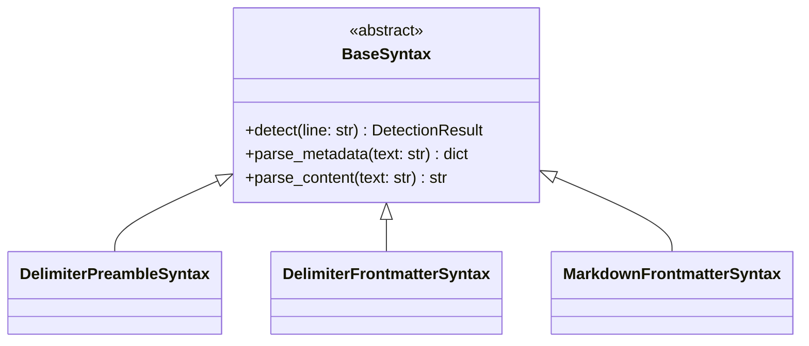

# Syntaxes Reference

Block syntax definitions for parsing different formats.

## Overview

Syntaxes define how blocks are detected and parsed in text streams. Streamblocks includes three built-in syntaxes.



## DelimiterPreambleSyntax

Compact inline syntax with metadata in the opening marker.

### Format

```text
!!block_id:block_type
Block content here
!!end
```

### Usage

```python
from hother.streamblocks import DelimiterPreambleSyntax

syntax = DelimiterPreambleSyntax()

# Custom delimiters
syntax = DelimiterPreambleSyntax(
    start_pattern=r"^<<(\w+):(\w+)$",
    end_marker="<<end",
)
```

### Parameters

| Parameter | Type | Default | Description |
|-----------|------|---------|-------------|
| `start_pattern` | `str` | `r"^!!(\w+):(\w+)$"` | Regex for opening marker |
| `end_marker` | `str` | `"!!end"` | Closing marker string |

### Example

```text
!!task01:task
Review the pull request
Add comments for improvement
!!end

!!code01:code
def hello():
    print("Hello!")
!!end
```

## DelimiterFrontmatterSyntax

Delimiter syntax with YAML frontmatter metadata section.

### Format

```text
<<<BLOCK
id: block01
type: task
priority: high
>>>
Block content here
<<<END>>>
```

### Usage

```python
from hother.streamblocks import DelimiterFrontmatterSyntax

syntax = DelimiterFrontmatterSyntax()

# Custom delimiters
syntax = DelimiterFrontmatterSyntax(
    start_delimiter="[[START]]",
    metadata_end="[[META]]",
    end_delimiter="[[END]]",
)
```

### Parameters

| Parameter | Type | Default | Description |
|-----------|------|---------|-------------|
| `start_delimiter` | `str` | `"<<<BLOCK"` | Opening marker |
| `metadata_end` | `str` | `">>>"` | Metadata section end |
| `end_delimiter` | `str` | `"<<<END>>>"` | Closing marker |

### Example

```text
<<<BLOCK
id: message01
type: message
author: assistant
>>>
Hello! How can I help you today?
<<<END>>>
```

## MarkdownFrontmatterSyntax

Standard Markdown frontmatter with YAML metadata.

### Format

```markdown
---
id: block01
type: task
priority: high
---
Block content here
---
```

### Usage

```python
from hother.streamblocks import MarkdownFrontmatterSyntax

syntax = MarkdownFrontmatterSyntax()

# Custom delimiters
syntax = MarkdownFrontmatterSyntax(
    delimiter="+++",  # TOML-style
)
```

### Parameters

| Parameter | Type | Default | Description |
|-----------|------|---------|-------------|
| `delimiter` | `str` | `"---"` | Frontmatter delimiter |

### Example

```markdown
---
id: article01
type: article
author: John Doe
tags:
  - python
  - tutorial
---
# Introduction

This is the article content.

---
```

## Syntax Selection

Choose syntax based on your use case:

| Syntax | Best For | Pros | Cons |
|--------|----------|------|------|
| `DelimiterPreambleSyntax` | LLM output, tool calls | Compact, easy to generate | Limited metadata |
| `DelimiterFrontmatterSyntax` | Structured documents | Full YAML metadata | More verbose |
| `MarkdownFrontmatterSyntax` | Markdown documents | Standard format | Conflicts with content |

## Creating Custom Syntaxes

Extend `BaseSyntax` for custom formats:

```python
from hother.streamblocks.syntaxes.base import BaseSyntax
from hother.streamblocks import DetectionResult

class XMLBlockSyntax(BaseSyntax):
    """XML-style block syntax."""

    def detect(self, line: str) -> DetectionResult:
        """Detect block markers in a line."""
        if line.startswith("<block"):
            # Parse attributes
            import re
            match = re.match(r'<block\s+id="(\w+)"\s+type="(\w+)">', line)
            if match:
                return DetectionResult(
                    is_opening=True,
                    metadata={
                        "id": match.group(1),
                        "block_type": match.group(2),
                    },
                )
        if line == "</block>":
            return DetectionResult(is_closing=True)
        return DetectionResult()

    def parse_metadata(self, text: str) -> dict:
        """Parse metadata from text."""
        return {}  # Metadata parsed in detect()

    def parse_content(self, text: str) -> str:
        """Parse content from text."""
        return text.strip()

    @property
    def name(self) -> str:
        return "xml_block"
```

### Required Methods

| Method | Description |
|--------|-------------|
| `detect(line)` | Detect block markers, return `DetectionResult` |
| `parse_metadata(text)` | Parse metadata section to dict |
| `parse_content(text)` | Parse content section |
| `name` | Syntax name property |

### DetectionResult Fields

| Field | Type | Description |
|-------|------|-------------|
| `is_opening` | `bool` | Line is block opening marker |
| `is_closing` | `bool` | Line is block closing marker |
| `is_metadata_boundary` | `bool` | Line ends metadata section |
| `metadata` | `dict \| None` | Inline metadata from marker |

## Multiple Syntaxes

Use multiple syntaxes in a single processor:

```python
from hother.streamblocks import (
    StreamBlockProcessor,
    Registry,
    DelimiterPreambleSyntax,
    MarkdownFrontmatterSyntax,
)

processor = StreamBlockProcessor(
    registry=Registry(),
    syntaxes=[
        DelimiterPreambleSyntax(),
        MarkdownFrontmatterSyntax(),
    ],
)

# Both formats are detected
text = """
!!task01:task
Do something
!!end

---
id: article01
type: article
---
Article content
---
"""
```

## API Reference

::: hother.streamblocks.syntaxes.DelimiterPreambleSyntax
    options:
      show_root_heading: true
      show_source: false
      members_order: source

::: hother.streamblocks.syntaxes.DelimiterFrontmatterSyntax
    options:
      show_root_heading: true
      show_source: false
      members_order: source

::: hother.streamblocks.syntaxes.MarkdownFrontmatterSyntax
    options:
      show_root_heading: true
      show_source: false
      members_order: source
