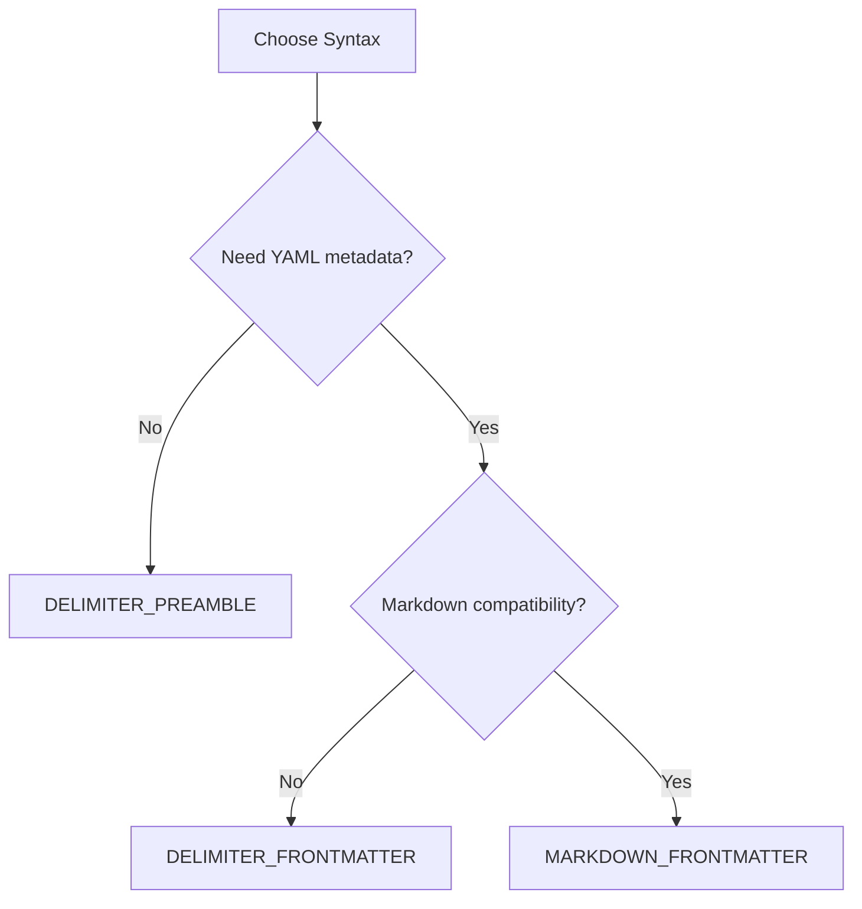
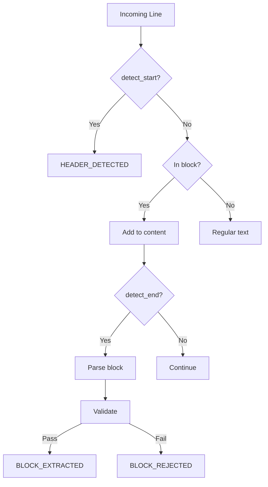

# Syntaxes

Syntaxes define how blocks are detected and parsed from text streams. This guide covers the built-in syntaxes and how to create custom ones.

## Overview

Streamblocks includes three built-in syntaxes:

| Syntax | Format | Use Case |
|--------|--------|----------|
| `DELIMITER_PREAMBLE` | `!!id:type\n...\n!!end` | Simple, compact blocks |
| `DELIMITER_FRONTMATTER` | `!!id\n---\nyaml\n---\n...\n!!end` | Rich metadata |
| `MARKDOWN_FRONTMATTER` | `` ```id\n---\nyaml\n---\n...\n``` `` | Markdown compatibility |

## Delimiter Preamble

The simplest syntax with inline metadata:

```
!!task01:task
Implement the authentication feature
!!end
```

### Structure

```
!!<id>:<type>
<content>
!!end
```

- **Start marker**: `!!` + block ID + `:` + block type
- **Content**: Any text between markers
- **End marker**: `!!end`

### Example

```python
from streamblocks import StreamBlockProcessor, BlockRegistry, Syntax

text = """
Here's what needs to be done:

!!task01:task
Implement user authentication
!!end

!!task02:task
Add password reset flow
!!end
"""

processor = StreamBlockProcessor(
    registry=BlockRegistry(),
    syntax=Syntax.DELIMITER_PREAMBLE,
)

# Extracts:
# Block 1: id="task01", type="task", content="Implement user authentication"
# Block 2: id="task02", type="task", content="Add password reset flow"
```

### Use Cases

- Simple task lists
- Quick annotations
- Minimal overhead
- When metadata is simple (just type)

## Delimiter Frontmatter

Extended format with YAML frontmatter:

```
!!task01
---
type: task
priority: high
assignee: alice
due_date: 2024-03-15
---
Implement the authentication feature with OAuth support.
!!end
```

### Structure

```
!!<id>
---
<yaml frontmatter>
---
<content>
!!end
```

- **Start marker**: `!!` + block ID
- **Frontmatter**: YAML between `---` markers
- **Content**: Any text after frontmatter
- **End marker**: `!!end`

### Example

```python
text = """
!!feature01
---
type: feature
priority: high
tags:
  - authentication
  - security
---
Implement OAuth 2.0 authentication with support for:
- Google
- GitHub
- Microsoft
!!end
"""

processor = StreamBlockProcessor(
    registry=BlockRegistry(),
    syntax=Syntax.DELIMITER_FRONTMATTER,
)

# Extracts:
# Block: id="feature01", type="feature", priority="high", ...
```

### Use Cases

- Complex metadata requirements
- Nested metadata (YAML structures)
- When you need more than just type

## Markdown Frontmatter

Compatible with Markdown code fences:

````
```task01
---
type: task
language: python
---
def authenticate(user, password):
    # Implement authentication logic
    pass
```
````

### Structure

````
```<id>
---
<yaml frontmatter>
---
<content>
```
````

- **Start marker**: `` ``` `` + block ID
- **Frontmatter**: YAML between `---` markers
- **Content**: Any text after frontmatter
- **End marker**: `` ``` ``

### Example

````python
text = """
Here's the implementation:

```code01
---
type: code
language: python
---
def greet(name):
    return f"Hello, {name}!"
```

And the tests:

```test01
---
type: code
language: python
---
def test_greet():
    assert greet("World") == "Hello, World!"
```
"""

processor = StreamBlockProcessor(
    registry=BlockRegistry(),
    syntax=Syntax.MARKDOWN_FRONTMATTER,
)
````

### Use Cases

- Markdown documents
- Code blocks with metadata
- Documentation with embedded blocks

## Syntax Selection

Choose the right syntax for your use case:



### Decision Factors

| Factor | Preamble | Frontmatter | Markdown |
|--------|----------|-------------|----------|
| Simplicity | Best | Good | Good |
| Metadata richness | Minimal | Full | Full |
| Markdown compat | No | No | Yes |
| Visual clarity | Good | Good | Best |
| Parse complexity | Low | Medium | Medium |

## Custom Syntaxes

Create custom syntaxes for specific formats.

### Basic Custom Syntax

```python
from streamblocks.syntaxes import BaseSyntax
from streamblocks.core.types import DetectionResult, ParseResult

class XMLSyntax(BaseSyntax):
    """Custom XML-style syntax."""

    def detect_start(self, line: str) -> DetectionResult | None:
        """Detect block start."""
        if line.strip().startswith("<block"):
            # Parse attributes from <block id="..." type="...">
            import re
            match = re.match(r'<block\s+id="(\w+)"\s+type="(\w+)">', line.strip())
            if match:
                return DetectionResult(
                    block_id=match.group(1),
                    block_type=match.group(2),
                )
        return None

    def detect_end(self, line: str) -> bool:
        """Detect block end."""
        return line.strip() == "</block>"

    def parse_block(self, candidate) -> ParseResult:
        """Parse complete block."""
        # Content is lines between start and end
        content = "\n".join(candidate.content_lines)
        return ParseResult(
            metadata={"id": candidate.block_id, "type": candidate.block_type},
            content=content,
            success=True,
        )
```

### Using Custom Syntax

```python
syntax = XMLSyntax()
processor = StreamBlockProcessor(
    registry=BlockRegistry(),
    syntax=syntax,
)

text = """
<block id="greeting" type="message">
Hello, World!
</block>
"""
```

### Syntax with YAML Frontmatter

```python
import yaml
from streamblocks.syntaxes import BaseSyntax

class CustomFrontmatterSyntax(BaseSyntax):
    """Custom syntax with YAML frontmatter."""

    START_PATTERN = "=== BEGIN ==="
    END_PATTERN = "=== END ==="
    FRONTMATTER_DELIMITER = "---"

    def detect_start(self, line: str) -> DetectionResult | None:
        if line.strip() == self.START_PATTERN:
            return DetectionResult(block_id="pending", block_type="pending")
        return None

    def detect_end(self, line: str) -> bool:
        return line.strip() == self.END_PATTERN

    def parse_block(self, candidate) -> ParseResult:
        lines = candidate.content_lines

        # Find frontmatter bounds
        fm_start = None
        fm_end = None

        for i, line in enumerate(lines):
            if line.strip() == self.FRONTMATTER_DELIMITER:
                if fm_start is None:
                    fm_start = i
                else:
                    fm_end = i
                    break

        # Parse frontmatter
        if fm_start is not None and fm_end is not None:
            fm_lines = lines[fm_start + 1:fm_end]
            metadata = yaml.safe_load("\n".join(fm_lines))
            content_lines = lines[fm_end + 1:]
        else:
            metadata = {}
            content_lines = lines

        return ParseResult(
            metadata=metadata,
            content="\n".join(content_lines),
            success=True,
        )
```

### Multi-Pattern Syntax

Support multiple start patterns:

```python
class MultiPatternSyntax(BaseSyntax):
    """Syntax that accepts multiple start patterns."""

    START_PATTERNS = ["<<BEGIN>>", "[[START]]", "{{BLOCK}}"]
    END_PATTERNS = ["<<END>>", "[[END]]", "{{/BLOCK}}"]

    def detect_start(self, line: str) -> DetectionResult | None:
        stripped = line.strip()
        for i, pattern in enumerate(self.START_PATTERNS):
            if stripped.startswith(pattern):
                # Extract ID from rest of line
                rest = stripped[len(pattern):].strip()
                return DetectionResult(
                    block_id=rest or f"block_{i}",
                    block_type="generic",
                )
        return None

    def detect_end(self, line: str) -> bool:
        stripped = line.strip()
        return any(stripped == p for p in self.END_PATTERNS)
```

## Syntax Detection Internals

### Detection Flow



### Performance Considerations

!!! tip "Fast Detection"
    Keep `detect_start` and `detect_end` fast. They're called for every line.

    ```python
    # Good: Simple string check
    def detect_start(self, line: str) -> DetectionResult | None:
        if line.startswith("!!"):
            return self._parse_header(line)
        return None

    # Bad: Complex regex on every line
    def detect_start(self, line: str) -> DetectionResult | None:
        # Expensive regex compiled on every call
        match = re.match(r'^!!(\w+):(\w+)(?:\s+\{.*\})?\s*$', line)
        ...
    ```

!!! tip "Pre-compile Patterns"
    Compile regex patterns once:

    ```python
    class MySyntax(BaseSyntax):
        START_PATTERN = re.compile(r'^!!(\w+):(\w+)\s*$')

        def detect_start(self, line: str) -> DetectionResult | None:
            match = self.START_PATTERN.match(line)
            ...
    ```

## Testing Syntaxes

### Unit Testing

```python
import pytest
from streamblocks import StreamBlockProcessor, BlockRegistry, Syntax

@pytest.fixture
def processor():
    return StreamBlockProcessor(
        registry=BlockRegistry(),
        syntax=Syntax.DELIMITER_PREAMBLE,
    )

async def test_basic_extraction(processor):
    text = "!!test01:task\nDo something\n!!end"

    events = []
    async for event in processor.process_stream(async_iter([text])):
        events.append(event)

    # Find extracted block
    extracted = [e for e in events if e.type == EventType.BLOCK_EXTRACTED]
    assert len(extracted) == 1
    assert extracted[0].block.metadata.id == "test01"
```

### Edge Cases

Test these edge cases:

```python
# Empty block
"!!empty:task\n!!end"

# Block with only whitespace
"!!space:task\n   \n!!end"

# Nested delimiters in content
"!!outer:task\n!!inner:task\nContent\n!!end\n!!end"

# Unicode content
"!!unicode:task\nこんにちは\n!!end"

# Very long content
"!!large:task\n" + ("x" * 100000) + "\n!!end"
```

## Next Steps

- [Block Types](blocks.md) - Custom block definitions
- [Validation](validation.md) - Block validation
- [Architecture: State Machine](architecture/state-machine.md) - Detection internals
