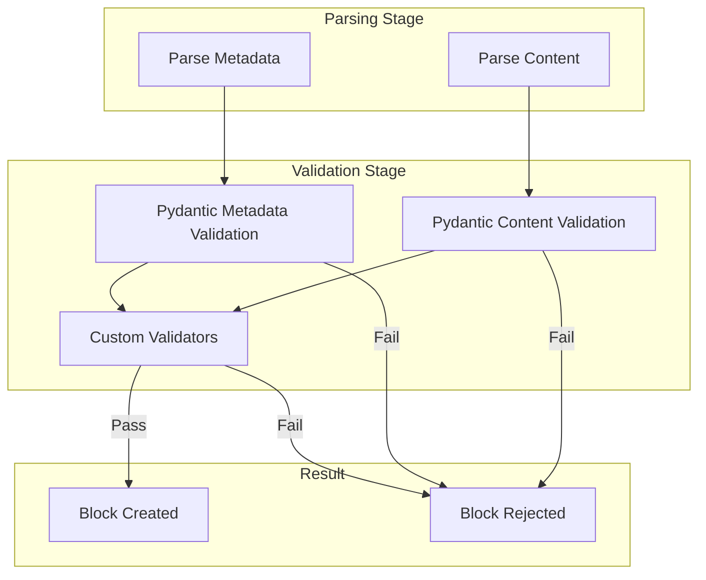
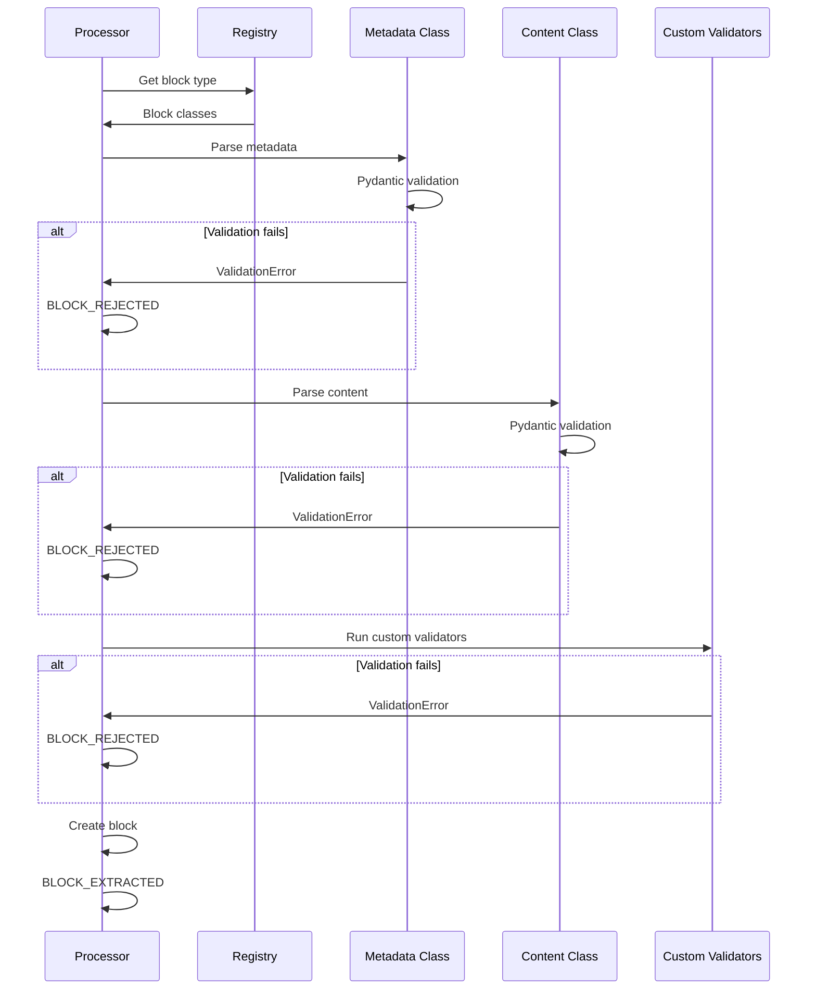

# Validation

Streamblocks provides a comprehensive validation system for block metadata and content. This guide covers the validation pipeline, built-in validators, and creating custom validation logic.

## Overview



## Pydantic Validation

Streamblocks uses Pydantic for model validation:

### Field Types

```python
from streamblocks import BaseMetadata
from typing import Literal

class TaskMetadata(BaseMetadata):
    block_type: Literal["task"] = "task"

    # Required fields
    title: str

    # Optional fields with defaults
    priority: str = "normal"
    assignee: str | None = None

    # Typed fields
    tags: list[str] = []
    due_date: str | None = None
```

### Field Validators

```python
from pydantic import field_validator

class TaskMetadata(BaseMetadata):
    block_type: Literal["task"] = "task"
    priority: str = "normal"

    @field_validator("priority")
    @classmethod
    def validate_priority(cls, v: str) -> str:
        valid_priorities = {"low", "normal", "high", "critical"}
        if v not in valid_priorities:
            raise ValueError(f"priority must be one of {valid_priorities}")
        return v
```

### Model Validators

```python
from pydantic import model_validator

class DateRangeMetadata(BaseMetadata):
    block_type: Literal["event"] = "event"
    start_date: str
    end_date: str

    @model_validator(mode="after")
    def validate_dates(self) -> "DateRangeMetadata":
        if self.end_date < self.start_date:
            raise ValueError("end_date must be after start_date")
        return self
```

## Content Validation

### Basic Content Validation

```python
from streamblocks import BaseContent
from pydantic import model_validator

class JSONContent(BaseContent):
    data: dict | None = None

    @classmethod
    def parse(cls, raw_text: str) -> "JSONContent":
        import json
        try:
            data = json.loads(raw_text)
        except json.JSONDecodeError:
            data = None
        return cls(raw_content=raw_text, data=data)

    @model_validator(mode="after")
    def validate_json(self) -> "JSONContent":
        if self.raw_content.strip() and self.data is None:
            raise ValueError("Content must be valid JSON")
        return self
```

### Content Format Validation

```python
class CodeContent(BaseContent):
    language: str = "text"
    is_valid: bool = True
    syntax_errors: list[str] = []

    @classmethod
    def parse(cls, raw_text: str) -> "CodeContent":
        content = cls(raw_content=raw_text)

        # Validate Python syntax
        if content.language == "python":
            import ast
            try:
                ast.parse(raw_text)
            except SyntaxError as e:
                content.is_valid = False
                content.syntax_errors.append(str(e))

        return content
```

## Validation Errors

### BlockErrorCode

```python
from streamblocks import BlockErrorCode

class BlockErrorCode(Enum):
    """Error codes for block rejection."""

    INVALID_HEADER = "invalid_header"
    INVALID_METADATA = "invalid_metadata"
    INVALID_CONTENT = "invalid_content"
    VALIDATION_FAILED = "validation_failed"
    MAX_SIZE_EXCEEDED = "max_size_exceeded"
    UNCLOSED_BLOCK = "unclosed_block"
    UNKNOWN_BLOCK_TYPE = "unknown_block_type"
```

### BlockRejection

```python
from streamblocks import BlockRejection

@dataclass
class BlockRejection:
    """Information about a rejected block."""

    reason: BlockErrorCode
    message: str
    partial_content: str | None = None
    line_number: int | None = None
```

### Handling Rejections

```python
async for event in processor.process_stream(stream):
    if event.type == EventType.BLOCK_REJECTED:
        rejection = event.rejection

        match rejection.reason:
            case BlockErrorCode.INVALID_METADATA:
                logger.warning(f"Invalid metadata: {rejection.message}")
            case BlockErrorCode.INVALID_CONTENT:
                logger.warning(f"Invalid content: {rejection.message}")
            case BlockErrorCode.MAX_SIZE_EXCEEDED:
                logger.warning("Block too large")
            case BlockErrorCode.UNKNOWN_BLOCK_TYPE:
                logger.warning(f"Unknown type: {rejection.message}")
```

## Validation Strategies

### Strict Validation

Reject any invalid blocks:

```python
class StrictMetadata(BaseMetadata):
    block_type: Literal["strict"] = "strict"

    # All required, no defaults
    title: str
    description: str
    category: str

    @field_validator("category")
    @classmethod
    def validate_category(cls, v: str) -> str:
        valid = {"bug", "feature", "task"}
        if v not in valid:
            raise ValueError(f"category must be one of {valid}")
        return v
```

### Lenient Validation

Accept with defaults for missing fields:

```python
class LenientMetadata(BaseMetadata):
    block_type: Literal["lenient"] = "lenient"

    # All optional with defaults
    title: str = "Untitled"
    description: str = ""
    category: str = "general"

    @field_validator("category", mode="before")
    @classmethod
    def coerce_category(cls, v: str) -> str:
        valid = {"bug", "feature", "task", "general"}
        return v if v in valid else "general"
```

### Coercive Validation

Transform invalid values:

```python
class CoerciveMetadata(BaseMetadata):
    block_type: Literal["coercive"] = "coercive"
    priority: int = 0

    @field_validator("priority", mode="before")
    @classmethod
    def coerce_priority(cls, v) -> int:
        if isinstance(v, int):
            return max(0, min(10, v))  # Clamp to 0-10
        if isinstance(v, str):
            mapping = {"low": 2, "normal": 5, "high": 8}
            return mapping.get(v.lower(), 5)
        return 5  # Default
```

## Custom Validators

### Registry-Level Validation

```python
from streamblocks import BlockRegistry

registry = BlockRegistry()

# Add custom validator
def validate_unique_ids(block, context):
    """Ensure block IDs are unique."""
    seen_ids = context.get("seen_ids", set())
    if block.metadata.id in seen_ids:
        raise ValueError(f"Duplicate block ID: {block.metadata.id}")
    seen_ids.add(block.metadata.id)
    context["seen_ids"] = seen_ids
    return block

registry.add_validator(validate_unique_ids)
```

### Content-Type Specific Validation

```python
def validate_code_block(block, context):
    """Validate code blocks have valid syntax."""
    if block.metadata.block_type != "code":
        return block

    content = block.content.raw_content
    language = block.metadata.language

    if language == "python":
        import ast
        try:
            ast.parse(content)
        except SyntaxError as e:
            raise ValueError(f"Invalid Python syntax: {e}")

    return block

registry.add_validator(validate_code_block)
```

## Size Validation

### Max Block Size

```python
processor = StreamBlockProcessor(
    registry=registry,
    syntax=syntax,
    max_block_size=100_000,  # 100KB limit
)
```

### Content Length Validation

```python
class LimitedContent(BaseContent):
    MAX_LENGTH = 10_000

    @model_validator(mode="after")
    def validate_length(self) -> "LimitedContent":
        if len(self.raw_content) > self.MAX_LENGTH:
            raise ValueError(f"Content exceeds {self.MAX_LENGTH} characters")
        return self
```

## Validation Pipeline



## Error Messages

### Descriptive Errors

```python
class TaskMetadata(BaseMetadata):
    block_type: Literal["task"] = "task"
    priority: str

    @field_validator("priority")
    @classmethod
    def validate_priority(cls, v: str) -> str:
        valid = {"low", "normal", "high"}
        if v not in valid:
            raise ValueError(
                f"Invalid priority '{v}'. "
                f"Must be one of: {', '.join(sorted(valid))}"
            )
        return v
```

### Aggregating Errors

```python
from pydantic import ValidationError

try:
    metadata = TaskMetadata(id="task01", priority="invalid")
except ValidationError as e:
    for error in e.errors():
        field = error["loc"][0]
        message = error["msg"]
        print(f"Field '{field}': {message}")
```

## Best Practices

!!! tip "Fail Fast"
    Validate as early as possible to catch errors quickly.

!!! tip "Descriptive Messages"
    Include helpful context in error messages.

!!! tip "Use Field Validators"
    Prefer `@field_validator` for single-field validation.

!!! tip "Use Model Validators"
    Use `@model_validator` for cross-field validation.

!!! tip "Test Edge Cases"
    Test with empty, null, and malformed input.

## Next Steps

- [Events](events.md) - Event handling
- [Error Handling](errors.md) - Error patterns
- [Blocks](blocks.md) - Block definitions
